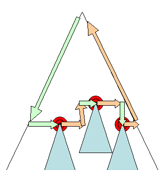

# 布局
呈现器在创建完成并添加到呈现树时，并不包含位置和大小信息。计算这些值的过程称为布局或重排。

HTML 采用基于流的布局模型，这意味着大多数情况下只要一次遍历就能计算出几何信息。处于流中靠后位置元素通常不会影响靠前位置元素的几何特征，因此布局可以按从左至右、从上至下的顺序遍历文档。但是也有例外情况，比如 HTML 表格的计算就需要不止一次的遍历 (3.5)。

坐标系是相对于根框架而建立的，使用的是上坐标和左坐标。

布局是一个递归的过程。它从根呈现器（对应于 HTML 文档的 `<html>` 元素）开始，然后递归遍历部分或所有的框架层次结构，为每一个需要计算的呈现器计算几何信息。

根呈现器的位置左边是 0,0，其尺寸为视口（也就是浏览器窗口的可见区域）。
所有的呈现器都有一个“layout”或者“reflow”方法，每一个呈现器都会调用其需要进行布局的子代的 layout 方法。
## Dirty 位系统
为避免对所有细小更改都进行整体布局，浏览器采用了一种“dirty 位”系统。如果某个呈现器发生了更改，或者将自身及其子代标注为“dirty”，则需要进行布局。

有两种标记：“dirty”和“children are dirty”。“children are dirty”表示尽管呈现器自身没有变化，但它至少有一个子代需要布局。
## 全局布局和增量布局
全局布局是指触发了整个呈现树范围的布局，触发原因可能包括：

1. 影响所有呈现器的全局样式更改，例如字体大小更改。
2. 屏幕大小调整。

布局可以采用增量方式，也就是只对 `dirty` 呈现器进行布局（这样可能存在需要进行额外布局的弊端）。

当呈现器为 `dirty` 时，会异步触发增量布局。例如，当来自网络的额外内容添加到 `DOM` 树之后，新的呈现器附加到了呈现树中。



图：增量布局 - 只有 dirty 呈现器及其子代进行布局 (3.6)。
## 异步布局和同步布局
增量布局是异步执行的。Firefox 将增量布局的“reflow 命令”加入队列，而调度程序会触发这些命令的批量执行。WebKit 也有用于执行增量布局的计时器：对呈现树进行遍历，并对 dirty 呈现器进行布局。

请求样式信息（例如“offsetHeight”）的脚本可同步触发增量布局。
全局布局往往是同步触发的。
有时，当初始布局完成之后，如果一些属性（如滚动位置）发生变化，布局就会作为回调而触发。
## 优化
如果布局是由“大小调整”或呈现器的位置（而非大小）改变而触发的，那么可以从缓存中获取呈现器的大小，而无需重新计算。

在某些情况下，只有一个子树进行了修改，因此无需从根节点开始布局。这适用于在本地进行更改而不影响周围元素的情况，例如在文本字段中插入文本（否则每次键盘输入都将触发从根节点开始的布局）。
## 布局处理
布局通常具有以下模式：

1. 父呈现器确定自己的宽度。
2. 父呈现器依次处理子呈现器，并且：
   1. 放置子呈现器（设置 x,y 坐标）。
   2. 如果有必要，调用子呈现器的布局（如果子呈现器是 dirty 的，或者这是全局布局，或出于其他某些原因），这会计算子呈现器的高度。
3. 父呈现器根据子呈现器的累加高度以及边距和补白的高度来设置自身高度，此值也可供父呈现器的父呈现器使用。
4. 将其 dirty 位设置为 false。

`Firefox` 使用“state”对象 (nsHTMLReflowState) 作为布局的参数（称为“reflow”），这其中包括了父呈现器的宽度。

`Firefox` 布局的输出为“metrics”对象 (nsHTMLReflowMetrics)，其包含计算得出的呈现器高度。
## 宽度计算
呈现器宽度是根据容器块的宽度、呈现器样式中的“width”属性以及边距和边框计算得出的。

例如以下 div 的宽度：
```html
<div style="width:30%"/>
```
将由 WebKit 计算如下（BenderBox 类，calcWidth 方法）：
- 容器的宽度取容器的 `availableWidth` 和 0 中的较大值。availableWidth 在本例中相当于 contentWidth，计算公式如下：
    ```js
    clientWidth() - paddingLeft() - paddingRight()
    ```
    `clientWidth` 和 `clientHeight` 表示一个对象的内部（除去边框和滚动条）。
- 元素的宽度是“width”样式属性。它会根据容器宽度的百分比计算得出一个绝对值。
- 然后加上水平方向的边框和补白。

现在计算得出的是“preferred width”。然后需要计算最小宽度和最大宽度。
如果首选宽度大于最大宽度，那么应使用最大宽度。如果首选宽度小于最小宽度（最小的不可破开单位），那么应使用最小宽度。

这些值会缓存起来，以用于需要布局而宽度不变的情况。
## 换行
如果呈现器在布局过程中需要换行，会立即停止布局，并告知其父代需要换行。父代会创建额外的呈现器，并对其调用布局。