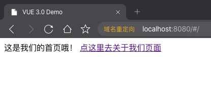
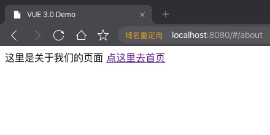

前两讲，我们已经顺利的使用 `vue3.0` 将项目跑起来了。但是实在是过于简陋，目前我们几乎不可能开发只有一个页面的应用。因此，`vue-router` 是必不可少的。

这一讲，我们就来讲讲最新的 `vue-router` 配合 `vue3.0` 是如何玩的。首先，我们进入我们的项目目录，安装依赖。我的 `demo` 目录为 `~/Sites/myWork/demo/vue3-demo`。

## 安装 vue-router

```bash
# 进入项目文件夹
cd ~/Sites/myWork/demo/vue3-demo
# 安装 vue-router
npm i vue-router@next
# 进入 src 目录
cd src
# 创建路由和视图文件夹
mkdir router views
# 创建路由基础文件和首页基础文件
touch router/index.js views/Home.vue views/About.vue
```

这里我安装到的版本是 `4.0.0-alpha.11` 还在 `alpha` 阶段。估计过几天就进入 `beta` 版本了。

执行完这些操作后，我们的 `src` 目录结构如下：

```
├── App.vue
├── main.js
├── router
│   └── index.js
└── views
    ├── About.vue
    └── Home.vue
```

跟着我上面的命令走，结构应该就是这个。如果不是的话，就好好检查一下咯，然后调整一下目录结构。

## 编写我们的各个文件

### src/router/index.js

```js
// 可以根据路由模式的不同，后面俩可以只引用一个
import {
  createRouter,
  createWebHistory,
  createWebHashHistory,
} from 'vue-router'
import Home from '@/views/Home.vue'

// 构建我们的页面路由配置，可以看到，这里和原来的写法并无二致。
const routes = [
  {
    path: '/',
    component: Home,
  },
  {
    path: '/about',
    component: () => import('@/views/About.vue'),
  },
]

const router = createRouter({
  // 使用 hash 模式构建路由（ url中带 # 号的那种)
  history: createWebHashHistory(),
  // 使用 history 模式构建路由 （ url 中没有 # 号，但生产环境需要特殊配置）
  // history: createWebHistory(),
  routes,
})
export default router
```

可以看到，这里也和原来的写法完全不一样了，变成了函数式的写法，也不用引入 vue 了。

### src/views/Home.vue

```html
<template>
  这是我们的首页哦！
  <router-link to="/about">点这里去关于我们页面</router-link>
</template>
```

得益于 `vue3.0` 的特性，我们现在不比把组件内容全部包裹在某一个 div 下面了，一个 `template` 里面可以有多个根节点元素，是没有关系的。

如果我没记错的话，当年 `vue 0.x` 版本中也是这样的。后来必须加个根节点，我还吐槽了一阵子。

### src/views/About.vue

```html
<template>
  这里是关于我们的页面
  <router-link to="/">点这里去首页</router-link>
</template>
```

### src/App.vue

```html
<template>
  <router-view />
</template>
```

我不喜欢无用的冗余节点，所以我的项目的 App.vue 文件，一概是只有一个 `router-view`

### src/main.js

```js
import { createApp } from 'vue'
import App from './App.vue'
import router from './router'

// 将创建的 App 搞个别名
const app = createApp(App)

// 使用路由配置
app.use(router)

// 挂载运行
app.mount('#app')
```

最近一直在写 `koa` 的东西，猛然间这样写 `vue`，让我有一种写 `nodejs` 后端的既视感。。。

这种感觉很好。如果你不理解，没关系，照抄。如果你理解，你自然知道我在说什么。

## 跑起来！

在项目根目录运行 `npm run dev` 即可把项目跑起来。我们看看结果：


点击链接，就可以看到关于我们的页面：



好的，可以看到，我们的 `vue-router` 已经很好的使用起来了！

## 小结

总的来说，构建页面路由的语法，是没有什么变化的。但是，在引用 vue-router 和创建上，有了变化。和 vue 3.0 一样，变成函数式的用法了。风格很统一，我很喜欢。

刚刚搜索了一下，发现中文资料比较少，有几个做视频教程的有讲到这些，但是视频教程是收费的。我尊重这些制作视频教程的老师，如果我的这些博文让你少赚钱了，我向你们道歉。

但是，如果作为学习的朋友，看到我的博文，就算赚到了。嘿嘿。点个赞，关个注，有啥问题给我评论留言。

此外，关于 `vuex` 的内容，我不准备在我的博文中讲到。原因有二，第一个是大多数小项目完全没必要上 `vuex`，第二个是目前的文档很不完善，等文档完善了，有之前的使用基础的朋友，可以很快上手的。你知道你要用，你就自然会用了。你不知道用在哪里，愣学，是没有意义的。

毕竟，学海无涯，而生有涯。

当然，因为我水平还是有限的，如果哪里讲错了，各位看官一定要在评论区中斧正，我这个人是知错就改的。

到目前为止，还是让我们的项目跑起来了，还没有谈到 vue 3.0 最大的变革，下一讲我们来讲哦！
