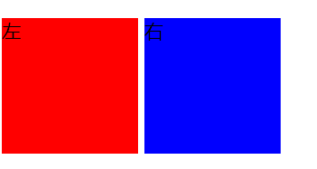

## 让一个元素水平垂直居中, 到底有多少种方案?


### 水平居中
- 对于 `行内元素`: text-align:center;
- 对于确定宽度的块级元素
  - `1.` width 和 margin 实现: `margin: 0 auto`
  - `2.` 绝对定位和 `margin-left: -width/2`, 前提是父元素`position:relative`
- 对于宽度未知的块级元素
  -  `1.` table标签配合margin左右auto实现水平居中。使用table标签（或直接将块级元素设值为`display:table`），再通过给该标签添加左右margin为auto。
  -  `2.` `inline-block`实现水平居中方法。`display：inline-block`和`text-align:center`实现水平居中。
  -  `3.` 绝对定位 + left +  transform:translateX 可以移动本身元素的 50%
        ```css
        .parent {
            width: 500px;
            height: 500px;
            background-color: aquamarine;
            position: relative;
        }
        .child {
            width: 300px;
            background-color: cadetblue;
            position: absolute;
            left: 50%;
            transform: translateX(-50%);
        }
        ```
    - `4.` flex布局使用 `justify-content:center`

        ```css
        .parent {
            display: flex;
            justify-content: center;
        }
        ```
### 垂直居中
1. 利用 `line-height`实现居中, 这种方法适合纯文字类
2. 通过设置父容器`相对定位`, 子级设置`绝对定位`, 标签通过`margin`实现自适应居中

    ```css
    .parent {
        position: relative;
    }
    .child {
        position: absolute;
        top: 50%;
        margin-top: -100px;
        background-color: cadetblue;
        text-align: center;
    }
    ```
3. 弹性布局`flex`:父级设置`display: flex`; 子级设置margin为auto实现自适应居中
4. 父级设置相对定位，子级设置绝对定位，并且通过位移`transform`实现

    ```css
    .parent {
        position: relative;
    }

    .child {
        position: absolute;
        top: 50%;
        transform: translateY(-50%);
    }
    ```
5. `table`布局，父级通过转换成表格形式，然后子级设置`vertical-align`实现。（需要注意的是：`vertical-align: middle` 使用的前提条件是内联元素以及`display`值为`table-cell`的元素）。

    ```css
    .parent {
        display: table;
    }
    .child {
        display: table-cell;
        vertical-align: middle;
        text-align: center;
    }
    ```

## 浮动布局的优点? 有什么缺点? 清除浮动有哪些方式
> 浮动布局简介:当元素浮动以后可以向左或向右移动，直到它的外边缘碰到包含它的框或者另外一个浮动元素的边框为止。元素浮动以后会脱离正常的文档流，所以文档的普通流中的框就变现的好像浮动元素不存在一样。

### 优点
这样做的优点就是在图文混排的时候可以很好的使文字环绕在图片周围。另外当元素浮动了起来之后，它有着块级元素的一些性质例如可以设置宽高等，但它与inline-block还是有一些区别的，第一个就是关于横向排序的时候，float可以设置方向而inline-block方向是固定的；还有一个就是inline-block在使用时有时会有空白间隙的问题

### 缺点
最明显的缺点就是浮动元素一旦脱离了文档流，就无法撑起父元素，会造成父级元素的高度塌陷。

### 清除浮动的方式
1. 添加额外标签

    ```html
    <div class="parent">
        <!-- 添加额外标签并且添加 clear 属性 -->
        <div style="clear:both"></div>
        <!-- 也可以 加一个 br标签 -->
    </div>
    ```
2. 父级添加 overflow 属性, 或者设置高度

    ```html
    <div class="parent" style="overflow:hidden">
    <!-- auto 也可以 -->
    <!-- 将父元素的overflow设置为hidden -->
    <div class="f"></div>
    </div>
    ```
3. 建立伪类选择器清除浮动(推荐)

    ```html
    <!-- 在 css 中 添加 : after 伪元素 -->
    <style>
        .parent:after{
            /* 设置添加子元素的内容是空 */
            content: '';  
            /* 设置添加子元素为块级元素 */
            display: block;
            /* 设置添加的子元素的高度0 */
            height: 0;
            /* 设置添加子元素看不见 */
            visibility: hidden;
            /* 设置clear：both */
            clear: both;
        }
    </style>
    <div class="parent">
        <div class="f"></div>
    </div>
    ```

##  使用display:inline-block会产生什么问题？解决方法？
### 问题复现
问题: 两个`display：inline-block`元素放到一起会产生一段空白

如代码:
```html
<!DOCTYPE html>
<html lang="en">
  <head>
    <meta charset="UTF-8">
    <meta name="viewport" content="width=device-width, initial-scale=1.0">
    <meta http-equiv="X-UA-Compatible" content="ie=edge">
    <title>Document</title>
    <style>
      .container {
        width: 800px;
        height: 200px;
      }

      .left {
        font-size: 14px;
        background: red;
        display: inline-block;
        width: 100px;
        height: 100px;
      }

      .right {
        font-size: 14px;
        background: blue;
        display: inline-block;
        width: 100px;
        height: 100px;
      }
    </style>
  </head>
  <body>
    <div class="container">
      <div class="left">
        左
      </div>
      <div class="right">
        右
      </div>
    </div>
  </body>
</html>
```

效果如下:




### 产生空白的原因
元素被当成行内元素排版的时候，元素之间的空白符（空格、回车换行等）都会被浏览器处理，根据CSS中`white-space`属性的处理方式（默认是`normal`，合并多余空白），原来HTML代码中的回车换行被转成一个空白符，在字体不为0的情况下，空白符占据一定宽度，所以`inline-block`的元素之间就出现了空隙。

### 解决方案
1. 将子元素标签的结束符和下一个标签的开始符写在同一行或把所有子标签写在同一行

    ```html
    <div class="container">
    <div class="left">
        左
    </div><div class="right">
        右
    </div>
    </div>
    ```
2. 父元素中设置font-size: 0，在子元素上重置正确的font-size

    ```css
    .container{
        width:800px;
        height:200px;
        font-size: 0;
    }
    ```
3. 为子元素设置  `float:left`

    ```css
    .left{  
        float:left;
        font-size:14px;
        background:red;
        display:inline-block;
        width:100px;
        height:100px;
    }
    /* right 是 同理 */
    .right{  
        float:left;
        font-size:14px;
        background:red;
        display:inline-block;
        width:100px;
        height:100px;
    }

    
    ```
    原理: 
    >If 'float' has a value other than 'none', the box is floated and 'display' is treated as 'block'


## 布局题：div垂直居中，左右10px，高度始终为宽度一半
>问题描述: 实现一个div垂直居中, 其距离屏幕左右两边各10px, 其高度始终是宽度的50%。同时div中有一个文字A，文字需要水平垂直居中。

### 思路一 利用height:0; padding-bottom: 50%;