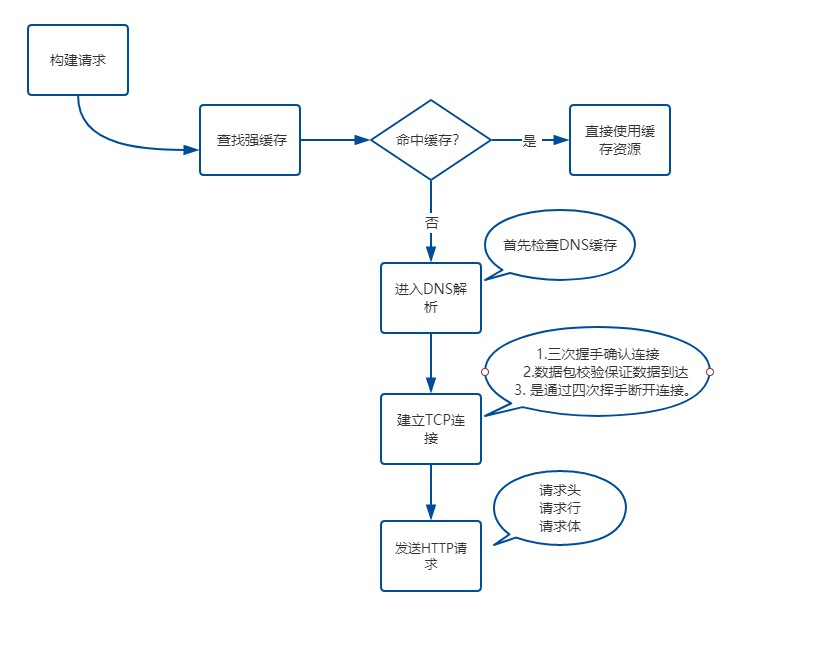
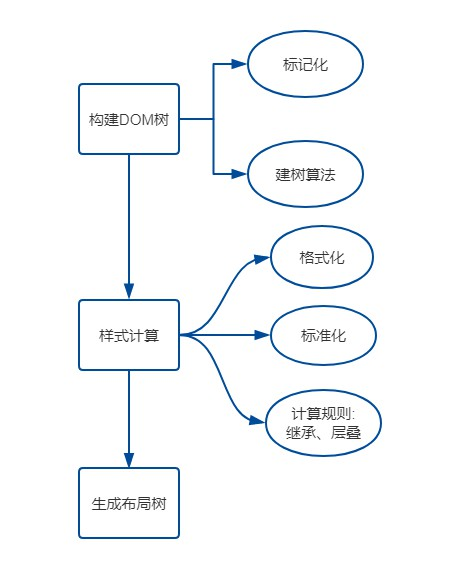
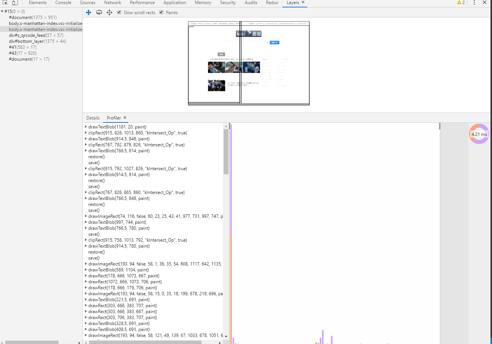
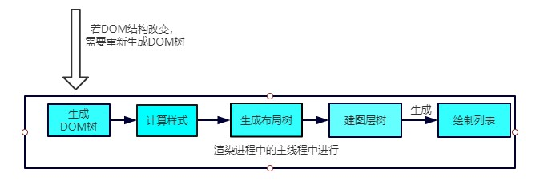

## 1: 说一说从输入URL到页面呈现发生了什么？——网络篇
这是一个可以无限难的问题。出这个题目的目的就是为了考察你的 web 基础深入到什么程度。由于水平和篇幅有限，在这里我将把其中一些重要的过程给大家梳理一遍，相信能在绝大部分的情况下给出一个比较惊艳的答案。

这里我提前声明，由于是一个综合性非常强的问题，可能会在某一个点上深挖出非常多的细节，我个人觉得学习是一个循序渐进的过程，在明白了整体过程后再去自己研究这些细节，会对整个知识体系有更深的理解。同时，关于延申出来的细节点我都有参考资料，看完这篇之后不妨再去深入学习一下，扩展知识面。

好，正题开始。

此时此刻，你在浏览器地址栏输入了百度的网址:

```js
https://www.baidu.com/
```
### 网络请求
#### 1. 构建请求
浏览器会构建请求行:
```js
// 请求方法是GET，路径为根路径，HTTP协议版本为1.1
GET / HTTP/1.1
```
#### 2. 查找强缓存
先检查强缓存，如果命中直接使用，否则进入下一步。关于强缓存，如果不清楚可以参考上一篇文章。
#### 3. DNS解析
由于我们输入的是域名，而数据包是通过`IP地址`传给对方的。因此我们需要得到域名对应的`IP地址`。这个过程需要依赖一个服务系统，这个系统将域名和 IP 一一映射，我们将这个系统就叫做DNS（域名系统）。得到具体 IP 的过程就是`DNS`解析。

当然，值得注意的是，浏览器提供了**DNS数据缓存功能**。即如果一个域名已经解析过，那会把解析的结果缓存下来，下次处理直接走缓存，不需要经过 DNS解析。

另外，如果不指定端口的话，默认采用对应的 IP 的 80 端口。

#### 4. 建立 TCP 连接
这里要提醒一点，Chrome 在同一个域名下要求同时最多只能有 6 个 TCP 连接，超过 6 个的话剩下的请求就得等待。

假设现在不需要等待，我们进入了 TCP 连接的建立阶段。首先解释一下什么是 TCP:
>TCP（Transmission Control Protocol，传输控制协议）是一种面向连接的、可靠的、基于字节流的传输层通信协议。

建立 `TCP连接`经历了下面三个阶段:
1. 通过**三次握手**(即总共发送3个数据包确认已经建立连接)建立客户端和服务器之间的连接。
2. 进行数据传输。这里有一个重要的机制，就是接收方接收到数据包后必须要向发送方**确认**, 如果发送方没有接到这个**确认**的消息，就判定为数据包丢失，并重新发送该数据包。当然，发送的过程中还有一个优化策略，就是把`大的数据包拆成一个个小包`，依次传输到接收方，接收方按照这个小包的顺序把它们**组装**成完整数据包。
3. 断开连接的阶段。数据传输完成，现在要断开连接了，通过**四次挥手**来断开连接。

读到这里，你应该明白 TCP 连接通过什么手段来保证数据传输的可靠性，一是**三次握手**确认连接，二是**数据包校验**保证数据到达接收方，三是通过四**次挥手**断开连接。

当然，如果再深入地问，比如**为什么要三次握手，两次不行吗？第三次握手失败了怎么办？为什么要四次挥手**等等这一系列的问题，涉及计算机网络的基础知识，比较底层，但是也是非常重要的细节，希望你能好好研究一下，另外这里有一篇不错的文章，[点击进入相应的推荐文章](https://zhuanlan.zhihu.com/p/86426969)，相信这篇文章能给你启发。

#### 5.发送 HTTP 请求
现在`TCP连接`建立完毕，浏览器可以和服务器开始通信，即开始发送 HTTP 请求。浏览器发 HTTP 请求要携带三样东西:**请求行**、**请求头**和**请求体**。

首先，浏览器会向服务器发送**请求行**,关于**请求行**， 我们在这一部分的第一步就构建完了，贴一下内容
```js
// 请求方法是GET，路径为根路径，HTTP协议版本为1.1
GET / HTTP/1.1
```
结构很简单，由**请求方法**、**请求URI**和**HTTP版本协议**组成。

同时也要带上**请求头**，比如我们之前说的`Cache-Control`、`If-Modified-Since`、`If-None-Match`都由可能被放入请求头中作为缓存的标识信息。当然了还有一些其他的属性，列举如下:
```js
Accept: text/html,application/xhtml+xml,application/xml;q=0.9,image/webp,image/apng,*/*;q=0.8,application/signed-exchange;v=b3
Accept-Encoding: gzip, deflate, br
Accept-Language: zh-CN,zh;q=0.9
Cache-Control: no-cache
Connection: keep-alive
Cookie: /* 省略cookie信息 */
Host: www.baidu.com
Pragma: no-cache
Upgrade-Insecure-Requests: 1
User-Agent: Mozilla/5.0 (iPhone; CPU iPhone OS 11_0 like Mac OS X) AppleWebKit/604.1.38 (KHTML, like Gecko) Version/11.0 Mobile/15A372 Safari/604.1
```
最后是请求体，请求体只有在`POST`方法下存在，常见的场景是**表单提交**。

### 网络响应
HTTP 请求到达服务器，服务器进行对应的处理。最后要把数据传给浏览器，也就是返回网络响应。

跟请求部分类似，网络响应具有三个部分:**响应行**、**响应头**和**响应体**。

响应行类似下面这样:
```js
HTTP/1.1 200 OK
```
由`HTTP协议版本`、`状态码`和`状态描述`组成。

响应头包含了服务器及其返回数据的一些信息, 服务器生成数据的时间、返回的数据类型以及对即将写入的Cookie信息。

举例如下:
```js
Cache-Control: no-cache
Connection: keep-alive
Content-Encoding: gzip
Content-Type: text/html;charset=utf-8
Date: Wed, 04 Dec 2019 12:29:13 GMT
Server: apache
Set-Cookie: rsv_i=f9a0SIItKqzv7kqgAAgphbGyRts3RwTg%2FLyU3Y5Eh5LwyfOOrAsvdezbay0QqkDqFZ0DfQXby4wXKT8Au8O7ZT9UuMsBq2k; path=/; domain=.baidu.com
```
响应完成之后怎么办？TCP 连接就断开了吗？

不一定。这时候要判断`Connection`字段, 如果请求头或响应头中包含`Connection: Keep-Alive`，表示建立了持久连接，这样`TCP`连接会一直保持，之后请求统一站点的资源会复用这个连接。

否则断开`TCP`连接, 请求-响应流程结束。

### 总结
到此，我们来总结一下主要内容，也就是浏览器端的网络请求过程：



## 2: 说一说从输入URL到页面呈现发生了什么？——解析算法篇
完成了网络请求和响应，如果响应头中`Content-Type`的值是`text/html`，那么接下来就是浏览器的**解析**和**渲染**工作了。

首先来介绍解析部分，主要分为以下几个步骤:

- 构建 `DOM` 树
- `样式`计算
- 生成`布局树`(`Layout Tree`)
### 构建 DOM 树
由于浏览器无法直接理解`HTML字符串`，因此将这一系列的字节流转换为一种有意义并且方便操作的数据结构，这种数据结构就是`DOM树`。`DOM树`本质上是一个以`document`为根节点的多叉树。

那通过什么样的方式来进行解析呢？

### HTML文法的本质
首先，我们应该清楚把握一点: HTML 的文法并不是`上下文无关文法`。

这里，有必要讨论一下什么是`上下文无关文法`。

在计算机科学的**编译原理**学科中，有非常明确的定义:
>若一个形式文法G = (N, Σ, P, S) 的产生式规则都取如下的形式：V->w，则叫上下文无关语法。其中 V∈N ，w∈(N∪Σ)* 。

其中把 G = (N, Σ, P, S) 中各个参量的意义解释一下:
1. N 是**非终结符**(顾名思义，就是说最后一个符号不是它, 下面同理)集合。
2. Σ 是**终结符**集合。
3. P 是开始符，它必须属于 N ，也就是非终结符。
4. S 就是不同的产生式的集合。如 S -> aSb 等等。

通俗一点讲，**上下文无关**的文法就是说这个文法中所有产生式的左边都是一个非终结符。

看到这里，如果还有一点懵圈，我举个例子你就明白了。

比如:
```js
A -> B
```
这个文法中，每个产生式左边都会有一个非终结符，这就是上下文无关的文法。在这种情况下，`xBy`一定是可以规约出`xAy`的。

我们下面看看看一个反例：
```js
aA -> B
Aa -> B
```
种情况就是不是上下文无关的文法，当遇到B的时候，我们不知道到底能不能规约出A，取决于左边或者右边是否有a存在，也就是说和上下文有关。

关于它为什么是非上下文无关文法，首先需要让大家注意的是，规范的 HTML 语法，是符合上下文无关文法的，能够体现它`非上下文无关`的是**不标准的语法**。在此我仅举一个反例即可证明。

比如解析器扫描到form标签的时候，**上下文无关文法**的处理方式是直接创建对应 form 的 DOM 对象，而真实的 HTML5 场景中却不是这样，解析器会查看 `form` 的上下文，如果这个 form 标签的父标签也是 `form`, 那么直接跳过当前的 `form` 标签，否则才创建 `DOM` 对象。

常规的编程语言都是**上下文无关**的，而HTML却相反，也正是它**非上下文无关**的特性，决定了`HTML Parser`并不能使用常规编程语言的解析器来完成，需要另辟蹊径。

### 解析算法
HTML5 [规范](https://html.spec.whatwg.org/multipage/parsing.html)详细地介绍了解析算法。这个算法分为两个阶段:

1. 标记化。
2. 建树。

对应的两个过程就是**词法分析**和**语法分析**。
#### 记化算法
这个算法输入为`HTML文本`，输出为`HTML标记`，也成为**标记生成器**。其中运用**有限自动状态机**来完成。即在当当前状态下，接收一个或多个字符，就会更新到下一个状态。
```js
<html>
  <body>
    Hello sanyuan
  </body>
</html>
```
通过一个简单的例子来演示一下**标记化**的过程。

遇到`<`, 状态为**标记打开**。

接收`[a-z]`的字符，会进入**标记名称状态**。

这个状态一直保持，直到遇到`>`，表示标记名称记录完成，这时候变为**数据状态**。

接下来遇到`body`标签做同样的处理。

这个时候`html`和`body`的标记都记录好了。

现在来到`<body>`中的`>`，进入**数据状态**，之后保持这样状态接收后面的字符`hello sanyuan`。

接着接收 `</body>` 中的`<`，回到**标记打开**, 接收下一个`/`后，这时候会创建一个end tag的token。

随后进入**标记名称状态**, 遇到>回到**数据状态**。

接着以同样的样式处理 `</body>`。

#### 建树算法
之前提到过，DOM 树是一个以`document`为根节点的多叉树。因此解析器首先会创建一个`document`对象。标记生成器会把每个标记的信息发送给**建树器**。**建树器**接收到相应的标记时，会**创建对应的 DOM 对象**。创建这个`DOM对象`后会做两件事情:
1. 将`DOM对象`加入 DOM 树中。
2. 将对应标记压入存放开放(与`闭合标签`意思对应)元素的栈中。

还是拿下面这个例子说:
```html
<html>
  <body>
    Hello sanyuan
  </body>
</html>
```
首先，状态为**初始化状态**。

接收到标记生成器传来的`html`标签，这时候状态变为**before html状态**。同时创建一个`HTMLHtmlElement`的 DOM 元素, 将其加到`document`根对象上，并进行压栈操作。

接着状态自动变为**before head**, 此时从标记生成器那边传来`body`，表示并没有`head`, 这时候**建树器**会自动创建一个**HTMLHeadElement**并将其加入到`DOM`树中。

现在进入到**in head**状态, 然后直接跳到**after head**。

现在**标记生成器**传来了`body`标记，创建**HTMLBodyElement**, 插入到`DOM`树中，同时压入开放标记栈。

接着状态变为**in body**，然后来接收后面一系列的字符: `Hello sanyuan`。接收到第一个字符的时候，会创建一个`Text`节点并把字符插入其中，然后把`Text`节点插入到 DOM 树中`body元素`的下面。随着不断接收后面的字符，这些字符会附在`Text`节点上。

现在，**标记生成器**传过来一个body的结束标记，进入到**after body**状态。

**标记生成器**最后传过来一个`html`的结束标记, 进入到`after after body`的状态，表示解析过程到此结束。

#### 容错机制
讲到`HTML5`规范，就不得不说它强大的**宽容策略**, 容错能力非常强，虽然大家褒贬不一，不过我想作为一名资深的前端工程师，有必要知道`HTML Parser`在容错方面做了哪些事情。

接下来是 WebKit 中一些经典的容错示例，发现有其他的也欢迎来补充。

1. 使用`</br>`而不是`<br>`

    ```js
    if (t->isCloseTag(brTag) && m_document->inCompatMode()) {
      reportError(MalformedBRError);
      t->beginTag = true;
    }
    ```
    全部换为`<br>`的形式。
2. 表格离散

    ```html
    <table>
      <table>
        <tr><td>inner table</td></tr>
      </table>
      <tr><td>outer table</td></tr>
    </table>
    ```
    `WebKit`会自动转换为:
    ```html
    <table>
        <tr><td>outer table</td></tr>
    </table>
    <table>
        <tr><td>inner table</td></tr>
    </table>
    ```
3. 表单元素嵌套
  
    这时候直接忽略里面的`form`。

### 样式计算
关于css样式, 它的来源一般是三种:
1. **link标签引用**
2. **style标签中的样式**
3. **元素的内嵌style属性**

#### 格式化样式表
首先，浏览器是无法直接识别 CSS 样式文本的，因此渲染引擎接收到 CSS 文本之后第一件事情就是将其转化为一个结构化的对象，即styleSheets。

这个格式化的过程过于复杂，而且对于不同的浏览器会有不同的优化策略，这里就不展开了。

在浏览器控制台能够通过`document.styleSheets`来查看这个最终的结构。当然，这个结构包含了以上三种CSS来源，为后面的样式操作提供了基础。

#### 标准化样式属性
有一些 CSS 样式的数值并不容易被渲染引擎所理解，因此需要在计算样式之前将它们标准化，如`em->px`,`red->#ff0000`,`bold->700`等等。

#### 计算每个节点的具体样式
样式已经被**格式化**和**标准化**,接下来就可以计算每个节点的具体样式信息了。

其实计算的方式也并不复杂，主要就是两个规则: **继承**和**层叠**。

每个子节点都会默认继承父节点的样式属性，如果父节点中没有找到，就会采用浏览器默认样式，也叫**UserAgent样式**。这就是继承规则，非常容易理解。

然后是层叠规则，CSS 最大的特点在于它的层叠性，也就是最终的样式取决于各个属性共同作用的效果，甚至有很多诡异的层叠现象，看过《CSS世界》的同学应该对此深有体会，具体的层叠规则属于深入 CSS 语言的范畴，这里就不过多介绍了。

不过值得注意的是，在计算完样式之后，所有的样式值会被挂在到`window.computedStyle`当中，也就是可以通过JS来获取计算后的样式，非常方便。

### 生成布局树
现在已经生成了`DOM树`和`DOM样式`，接下来要做的就是通过浏览器的布局系统`确定元素的位置`，也就是要生成一棵`布局树`(Layout Tree)。

布局树生成的大致工作如下:
1. 遍历生成的DOM树节点, 并把他们添加到`布局树`中
2. 计算布局树节点的坐标位置

值得注意的是，这棵布局树值包含可见元素，对于 `head`标签和设置了`display: none`的元素，将不会被放入其中。

有人说首先会生成`Render Tree`，也就是渲染树，其实这还是 16 年之前的事情，现在 Chrome 团队已经做了大量的重构，已经没有生成`Render Tree`的过程了。而布局树的信息已经非常完善，完全拥有`Render Tree`的功能。

之所以不讲布局的细节，是因为它过于复杂，一一介绍会显得文章过于臃肿，不过大部分情况下我们只需要知道它所做的工作**是什么**即可，如果想深入其中的原理，知道它是如何来做的，我强烈推荐你去读一读人人FED团队的文章[从Chrome源码看浏览器如何layout布局](https://www.rrfed.com/2017/02/26/chrome-layout/)。

### 总结
梳理一下这一节的主要脉络:




## 3: 说一说从输入URL到页面呈现发生了什么？——渲染过程篇
上一节介绍了浏览器**解析**的过程,其中包含**构建DOM**、**样式计算**和**构建布局树**。

接下来就来拆解下一个过程——**渲染**。分为以下几个步骤:

- 建立`图层树`(Layer Tree)
- 生成`绘制列表`
- 生成`图块`并`栅格化`
- 显示器显示内容
### 一、建图层树
如果你觉得现在 `DOM节点` 也有了, 样式和位置信息也都有了, 可以开始绘制页面了, 那你就错了.

因为你考虑掉了另外一些复杂的场景，比如3D动画如何呈现出变换效果，当元素含有层叠上下文时如何控制显示和隐藏等等。

为了解决如上所述的问题，浏览器在构建完**布局树**之后，还会对特定的节点进行分层，构建一棵**图层树(Layer Tree)**。

那这棵图层树是根据什么来构建的呢？

一般情况下，节点的图层会默认属于父亲节点的图层(这些图层也称为**合成层**)。那什么时候会提升为一个单独的合成层呢？

有两种情况需要分别讨论，一种是**显式合成**，一种是**隐式合成**。

#### 显式合成
下面是**显式合成**的情况:
##### 一、 拥有层叠上下文的节点。
层叠上下文也基本上是有一些特定的CSS属性创建的，一般有以下情况:

1. HTML根元素本身就具有层叠上下文。
2. 普通元素设置**position不为static**并且设置了**z-index属性**，会产生层叠上下文。
3. 元素的 `opacity` 值不是 1
4. 元素的 `transform` 值不是 none
5. 元素的 `filter` 值不是 none
6. 元素的 `isolation` 值是isolate
7. `will-change`指定的属性值为上面任意一个。(will-change的作用后面会详细介绍)

##### 二、需要剪裁的地方。
比如一个div，你只给他设置 100 * 100 像素的大小，而你在里面放了非常多的文字，那么超出的文字部分就需要被剪裁。当然如果出现了滚动条，那么滚动条会被单独提升为一个图层。

#### 隐式合成
接下来是**隐式合成**，简单来说就是**层叠等级低**的节点被提升为单独的图层之后，那么**所有层叠等级比它高**的节点**都会**成为一个单独的图层。

这个隐式合成其实隐藏着巨大的风险，如果在一个大型应用中，当一个`z-index`比较低的元素被提升为单独图层之后，层叠在它上面的的元素统统都会被提升为单独的图层，可能会增加上千个图层，大大增加内存的压力，甚至直接让页面崩溃。这就是层爆炸的原理。这里有一个具体的例子，[点击打开](https://segmentfault.com/a/1190000014520786)。

值得注意的是，当需要`repaint`时，只需要`repaint`本身，而不会影响到其他的层。

### 二、生成绘制列表
接下来渲染引擎会将图层的绘制拆分成一个个绘制指令，比如先画背景、再描绘边框......然后将这些指令按顺序组合成一个待绘制列表，相当于给后面的绘制操作做了一波计划。

这里我以百度首页为例，大家可以在 Chrome 开发者工具中在设置栏中展开 `more tools`, 然后选择`Layers`面板，就能看到下面的绘制列表:



### 三、生成图块和生成位图
现在开始绘制操作，实际上在渲染进程中绘制操作是由专门的线程来完成的，这个线程叫**合成线程**。

绘制列表准备好了之后，渲染进程的主线程会给`合成线程`发送`commit`消息，把绘制列表提交给合成线程。接下来就是合成线程一展宏图的时候啦。

首先，考虑到视口就这么大，当页面非常大的时候，要滑很长时间才能滑到底，如果要一口气全部绘制出来是相当浪费性能的。因此，合成线程要做的第一件事情就是将图层**分块**。这些块的大小一般不会特别大，通常是 256 * 256 或者 512 * 512 这个规格。这样可以大大加速页面的首屏展示。

因为后面图块数据要进入 GPU 内存，考虑到浏览器内存上传到 GPU 内存的操作比较慢，即使是绘制一部分图块，也可能会耗费大量时间。针对这个问题，Chrome 采用了一个策略: 在首次合成图块时只采用一个**低分辨率**的图片，这样首屏展示的时候只是展示出低分辨率的图片，这个时候继续进行合成操作，当正常的图块内容绘制完毕后，会将当前低分辨率的图块内容替换。这也是 Chrome 底层优化首屏加载速度的一个手段。

顺便提醒一点，渲染进程中专门维护了一个**栅格化线程池**，专门负责把**图块**转换为**位图数据**。

然后合成线程会选择视口附近的**图块**，把它交给**栅格化线程池**生成位图。

生成位图的过程实际上都会使用 GPU 进行加速，生成的位图最后发送给**合成线程**。

### 四、显示器显示内容
栅格化操作完成后，**合成线程**会生成一个绘制命令，即"DrawQuad"，并发送给浏览器进程。

浏览器进程中的`viz组件`接收到这个命令，根据这个命令，把页面内容绘制到内存，也就是生成了页面，然后把这部分内存发送给显卡。为什么发给显卡呢？我想有必要先聊一聊显示器显示图像的原理。

无论是 PC 显示器还是手机屏幕，都有一个固定的刷新频率，一般是 60 HZ，即 60 帧，也就是一秒更新 60 张图片，一张图片停留的时间约为 16.7 ms。而每次更新的图片都来自显卡的**前缓冲区**。而显卡接收到浏览器进程传来的页面后，会合成相应的图像，并将图像保存到**后缓冲区**，然后系统自动将前缓冲区和后缓冲区对换位置，如此循环更新。

看到这里你也就是明白，当某个动画大量占用内存的时候，浏览器生成图像的时候会变慢，图像传送给显卡就会不及时，而显示器还是以不变的频率刷新，因此会出现卡顿，也就是明显的掉帧现象。

### 总结
到这里，我们算是把整个过程给走通了，现在重新来梳理一下页面渲染的流程。


## 4: 谈谈你对重绘和回流的理解。
我们首先来回顾一下**渲染流水线**的流程:


接下来，我们将来以此为依据来介绍重绘和回流，以及让更新视图的另外一种方式——合成。

### 回流
首先介绍**回流**。回流也叫**重排**。

#### 触发条件
简单来说, 就是当我们对 DOM 结构的修改引发DOM几何尺寸变化的时候, 会发生`回流`的过程

具体一点,有以下的操作会触发回流
1. 一个 DOM 元素的几何属性变化，常见的几何属性有`width`、`height`、`padding`、`margin`、`left`、`top`、`border` 等等, 这个很好理解。
2. 使 DOM 节点发生`增减`或者`移动`。
3. 读写 `offset`族、`scroll`族和`client`族属性的时候，浏览器为了获取这些值，需要进行回流操作。
4. 调用 `window.getComputedStyle` 方法。

#### 回流过程
依照上面的渲染流水线，触发回流的时候，如果 DOM 结构发生改变，则重新渲染 DOM 树，然后将后面的流程(包括主线程之外的任务)全部走一遍。



相当于将解析和合成的过程重新又走了一篇，开销是非常大的。

### 重绘
#### 触发条件
当 DOM 的修改导致了样式的变化，并且没有影响几何属性的时候，会导致重绘(`repaint`)。

#### 重绘过程

由于没有导致 DOM 几何属性的变化，因此元素的位置信息不需要更新，从而省去布局的过程。流程如下：


跳过了**生成布局树**和**建图层树**的阶段，直接生成绘制列表，然后继续进行分块、生成位图等后面一系列操作。

可以看到，重绘不一定导致回流，但回流一定发生了重绘。

### 合成
还有一种情况，是直接合成。比如利用 CSS3 的`transform`、`opacity`、`filter`这些属性就可以实现合成的效果，也就是大家常说的**GPU加速**。

#### GPU加速的原因
在合成的情况下，会直接跳过布局和绘制流程，直接进入**非主线程**处理的部分，即直接交给**合成线程**处理。交给它处理有两大好处:

1. 能够充分发挥`GPU`的优势。合成线程生成位图的过程中会调用线程池，并在其中使用`GPU`进行加速生成，而`GPU` 是擅长处理位图数据的。
2. 没有占用主线程的资源，即使主线程卡住了，效果依然能够流畅地展示。

### 实践意义
知道上面的原理之后，对于开发过程有什么指导意义呢？

1. 避免频繁使用 `style`，而是采用修改`class`的方式。
2. 使用`createDocumentFragment`进行批量的 DOM 操作。
3. 对于 `resize`、`scroll` 等进行防抖/节流处理。
4. 添加 `will-change: tranform` ，让渲染引擎为其单独实现一个图层，当这些变换发生时，仅仅只是利用合成线程去处理这些变换，而不牵扯到主线程，大大提高渲染效率。当然这个变化不限于`tranform`, 任何可以实现合成效果的 CSS 属性都能用`will-change`来声明。这里有一个实际的例子，一行`will-change: tranform`拯救一个项目，[点击直达](https://juejin.im/post/5da52531518825094e373372)。