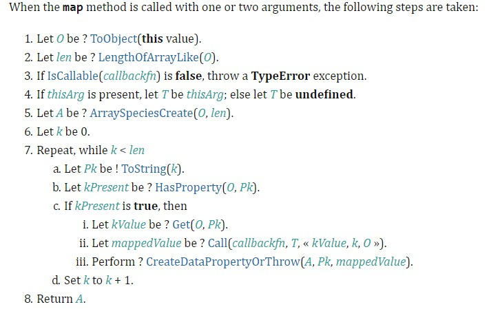
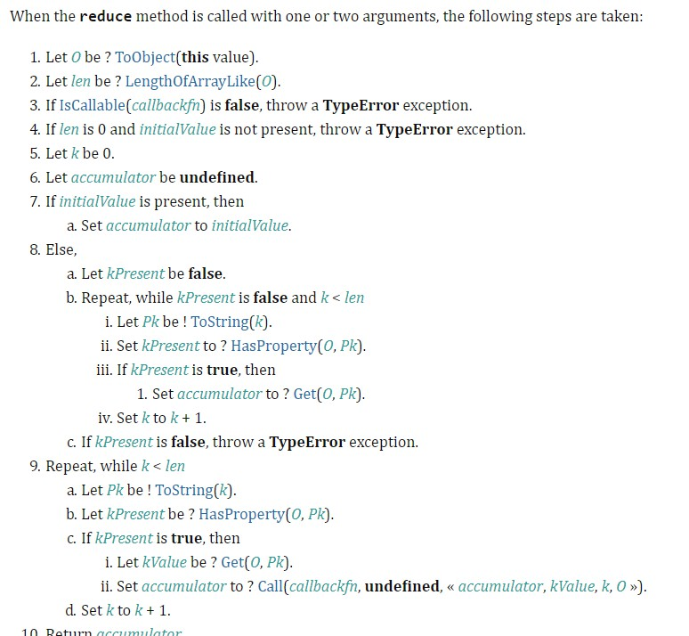
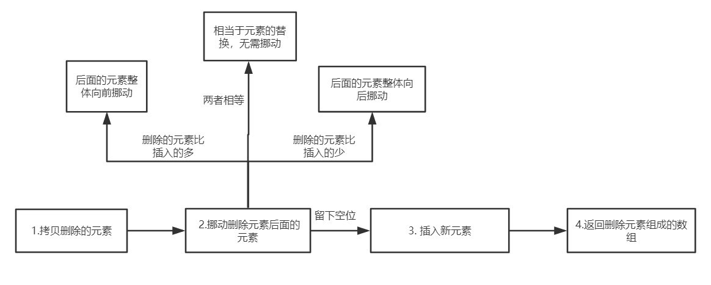
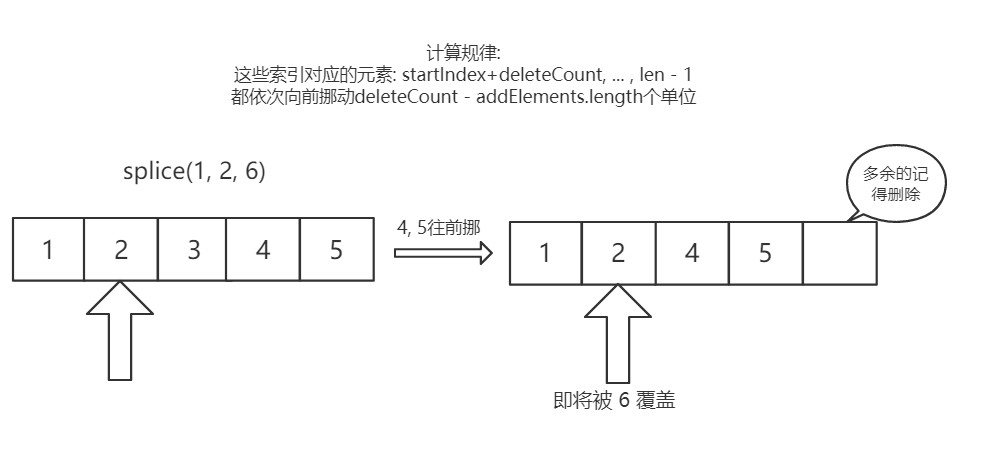
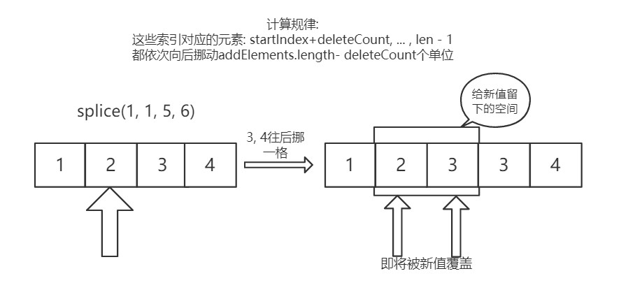
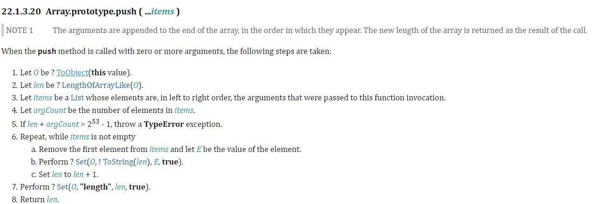
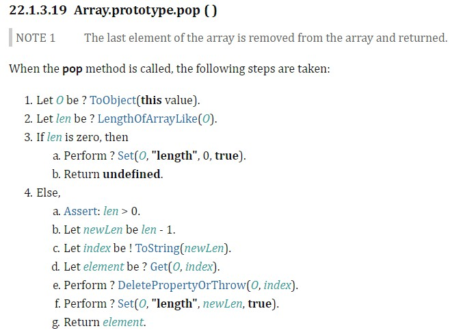

## 1.什么是高阶函数
概念非常简单，如下:

>一个函数就可以接收另一个函数作为参数或者返回值为一个函数，这种函数就称之为高阶函数。

那对应到数组中有哪些方法呢？

## 2.数组中的高阶函数
### 1. map
- 参数: 接受两个参数, 一个是回调函数, 一个是回调函数的this值(可选)

其中，回调函数被默认传入三个值，依次为当前元素、当前索引、整个数组。

- 创建一个新数组，其结果是该数组中的每个元素都调用一个提供的函数后返回的结果
- 对原来的数组没有影响

    ```js
    let nums = [1, 2, 3];
    let obj = {val: 5};
    let newNums = nums.map(function(item,index,array) {
    return item + index + array[index] + this.val; 
    //对第一个元素，1 + 0 + 1 + 5 = 7
    //对第二个元素，2 + 1 + 2 + 5 = 10
    //对第三个元素，3 + 2 + 3 + 5 = 13
    }, obj);
    console.log(newNums);//[7, 10, 13]
    ```
当然，后面的参数都是可选的 ，不用的话可以省略。

### 2. reduce
- 参数: 接受两个参数, 一个为回调函数, 另一个为初始值. 回调函数中三个默认参数, 依次为积累值, 当前值, 整个数组

```js
let nums = [1, 2, 3];
// 多个数的加和
let newNums = nums.reduce(function(preSum,curVal,array) {
return preSum + curVal; 
}, 0);
console.log(newNums);//6
```
不传默认值会怎样？

不传默认值会自动以第一个元素为初始值，然后从第二个元素开始依次累计。

### 3. filter
- 参数: 一个函数参数。这个函数接受一个默认参数，就是当前元素。这个作为参数的函数返回值为一个布尔类型，决定元素是否保留。

filter方法返回值为一个新的数组，这个数组里面包含参数里面所有被保留的项。
```js
let nums = [1, 2, 3];
// 保留奇数项
let oddNums = nums.filter(item => item % 2);
console.log(oddNums);
```
### 4. sort
- 参数: 一个用于比较的函数, 它有两个默认参数, 分别是代表比较的两个元素

举个例子:
```js
let nums = [2, 3, 1];
//两个比较的元素分别为a, b
nums.sort(function(a, b) {
  if(a > b) return 1;
  else if(a < b) return -1;
  else if(a == b) return 0;
})
```
当比较函数返回值大于0，则 a 在 b 的后面，即a的下标应该比b大。

反之，则 a 在 b 的后面，即 a 的下标比 b 小。

整个过程就完成了一次升序的排列。

当然还有一个需要注意的情况，就是比较函数不传的时候，是如何进行排序的？

>答案是将数字转换为字符串，然后根据字母unicode值进行升序排序，也就是根据字符串的比较规则进行升序排序。

## 3. 函数的arguments为什么不是数组？如何转化成数组？
因为argument是一个对象，只不过它的属性从0开始排，依次为0，1，2...最后还有callee和length属性。我们也把这样的对象称为类数组。

常见的类数组还有：
1. 用`getElementByTagName/ClassName/Name（`）获得的`HTMLCollection`
2. 用`querySlector`获得的`nodeList`

那这导致很多数组的方法就不能用了，必要时需要我们将它们转换成数组，有哪些方法呢？

### 1. Array.prototype.slice.call()
```js
function sum(a, b) {
  let args = Array.prototype.slice.call(arguments);
  console.log(args.reduce((sum, cur) => sum + cur));//args可以调用数组原生的方法啦
}
sum(1, 2);//3
```
### 2. Array.from()
```js
function sum(a, b) {
  let args = Array.from(arguments);
  console.log(args.reduce((sum, cur) => sum + cur));//args可以调用数组原生的方法啦
}
sum(1, 2);//3
```
这种方法也可以用来转换Set和Map哦！

### 3. ES6展开运算符
```js
function sum(a, b) {
  let args = [...arguments];
  console.log(args.reduce((sum, cur) => sum + cur));//args可以调用数组原生的方法啦
}
sum(1, 2);//3
```
### 4. 利用concat+apply
```js
function sum(a, b) {
  let args = Array.prototype.concat.apply([], arguments);//apply方法会把第二个参数展开
  console.log(args.reduce((sum, cur) => sum + cur));//args可以调用数组原生的方法啦
}
sum(1, 2);//3
```
当然，最原始的方法就是再创建一个数组，用for循环把类数组的每个属性值放在里面，过于简单，就不浪费篇幅了。

## 4. forEach中return有效果吗？如何中断forEach循环？

在`forEach`中用return不会返回，函数会继续执行。
```js
let nums = [1, 2, 3];
nums.forEach((item, index) => {
  return;//无效
})
```
中断方法：

1. 使用try监视代码块，在需要中断的地方抛出异常。

2. 官方推荐方法（替换方法）：用`every`和`some`替代forEach函数。`every`在碰到`return false`的时候，中止循环。`some`在碰到`return true`的时候，中止循环

## 5. JS判断数组中是否包含某个值
### 方法一：`array.indexOf`
此方法判断数组中是否存在某个值，如果存在，则返回数组元素的下标，否则返回-1。
```js
var arr=[1,2,3,4];
var index=arr.indexOf(3);
console.log(index);
```
### 方法二: array.includes(searchElement[,fromIndex])h

>此方法判断数组中是否存在某个值，如果存在返回true，否则返回false
```js
var arr=[1,2,3,4];
if(arr.includes(3))
    console.log("存在");
else
    console.log("不存在");
```
### 方法三：array.find(callback[,thisArg])
>返回数组中满足条件的第一个元素的值，如果没有，返回`undefined`
```js
var arr=[1,2,3,4];
var result = arr.find(item =>{
    return item > 3
});
console.log(result);
```
### 方法四: array.findIndex(callback[,thisArg])
>返回数组中满足条件的第一个元素的下标，如果没有找到，返回-1

```js
var arr=[1,2,3,4];
var result = arr.findIndex(item =>{
    return item > 3
});
console.log(result);
```
当然，for循环当然是没有问题的，这里讨论的是数组方法，就不再展开了。

## 6. JS中 flat --- 数组偏平化
对于前端项目开发过程中，偶尔会出现层叠数据结构的数组，我们需要将多层级数组转化为一级数组（即提取嵌套数组元素最终合并为一个数组），使其内容合并且展开。那么该如何去实现呢？

需求:多维数组=>一维数组
```js
let ary = [1, [2, [3, [4, 5]]], 6];// -> [1, 2, 3, 4, 5, 6]
let str = JSON.stringify(ary);
```
### 1. 调用ES6的flat方法
```js
arr = arr.flat(Infinity);
```
### 2. replace + split
```js
ary = str.replace(/(\[|\])/g, '').split(',')
```
### 3. replace + JSON.parse
```js
str = str.replace(/(\[|\]))/g, '');
str = '[' + str + ']';
ary = JSON.parse(str);
```
### 4. 普通递归
```js
let result = [];
let fn = function(ary) {
  for(let i = 0; i < ary.length; i++) {
    let item = ary[i];
    if (Array.isArray(ary[i])){
      fn(item);
    } else {
      result.push(item);
    }
  }
}
```
### 5. 利用 reduce 函数 迭代
```js
function flatten(ary) {
    return ary.reduce((pre, cur) => {
        return pre.concat(Array.isArray(cur) ? flatten(cur) : cur);
    }, []);
}
let ary = [1, 2, [3, 4], [5, [6, 7]]]
console.log(flatten(ary))
```
### 6. 扩展运算符
```js
//只要有一个元素有数组，那么循环继续
while (ary.some(Array.isArray())) {
  ary = [].concat(...ary);
}
```
这是一个比较实用而且很容易被问到的问题，欢迎大家交流补充。

## 7. 手写数组的 map 方法?
依照 [ecma262 草案](https://tc39.es/ecma262/#sec-array.prototype.map)，实现的map的规范如下:



下面根据草案的规定一步步来模拟实现map函数:
```js
Array.prototype.map = function(callbackFn, thisArg) {
  // 处理数组类型异常
  if (this === null || this === undefined) {
    throw new TypeError("Cannot read property 'map' of null or undefined");
  }
  // 处理回调类型异常
  if (Object.prototype.toString.call(callbackfn) != "[object Function]") {
    throw new TypeError(callbackfn + ' is not a function')
  }
  // 草案中提到要先转换为对象
  let O = Object(this);
  let T = thisArg;

  
  let len = O.length >>> 0;
  let A = new Array(len);
  for(let k = 0; k < len; k++) {
    // 还记得原型链那一节提到的 in 吗？in 表示在原型链查找
    // 如果用 hasOwnProperty 是有问题的，它只能找私有属性
    if (k in O) {
      let kValue = O[k];
      // 依次传入this, 当前项，当前索引，整个数组
      let mappedValue = callbackfn.call(T, KValue, k, O);
      A[k] = mappedValue;
    }
  }
  return A;
}
```
这里解释一下, `length >>> 0`, 字面意思是指"右移 0 位"，但实际上是把前面的空位用0填充，这里的作用是保证len为数字且为整数。

举几个特例：
```js
null >>> 0  //0

undefined >>> 0  //0

void(0) >>> 0  //0

function a (){};  a >>> 0  //0

[] >>> 0  //0

var a = {}; a >>> 0  //0

123123 >>> 0  //123123

45.2 >>> 0  //45

0 >>> 0  //0

-0 >>> 0  //0

-1 >>> 0  //4294967295

-1212 >>> 0  //4294966084
```
总体实现起来并没那么难，需要注意的就是使用 in 来进行原型链查找。同时，如果没有找到就不处理，能有效处理稀疏数组的情况。

最后给大家奉上V8源码，参照源码检查一下，其实还是实现得很完整了。
```js
function ArrayMap(f, receiver) {
  CHECK_OBJECT_COERCIBLE(this, "Array.prototype.map");

  // Pull out the length so that modifications to the length in the
  // loop will not affect the looping and side effects are visible.
  var array = TO_OBJECT(this);
  var length = TO_LENGTH(array.length);
  if (!IS_CALLABLE(f)) throw %make_type_error(kCalledNonCallable, f);
  var result = ArraySpeciesCreate(array, length);
  for (var i = 0; i < length; i++) {
    if (i in array) {
      var element = array[i];
      %CreateDataProperty(result, i, %_Call(f, receiver, element, i, array));
    }
  }
  return result;
}
```
## 8. 手写数组的 reduce 方法 ?
依照 [ecma262 草案](https://tc39.es/ecma262/#sec-array.prototype.reduce)，实现的reduce的规范如下:



其中有几个核心要点:

1. 初始值不传怎么处理

2. 回调函数的参数有哪些，返回值如何处理。

```js
Array.prototype.reduce  = function(callbackfn, initialValue) {
  // 异常处理，和 map 一样
  // 处理数组类型异常
  if (this === null || this === undefined) {
    throw new TypeError("Cannot read property 'reduce' of null or undefined");
  }
  // 处理回调类型异常
  if (Object.prototype.toString.call(callbackfn) != "[object Function]") {
    throw new TypeError(callbackfn + ' is not a function')
  }
  let O = Object(this);
  let len = O.length >>> 0;
  let k = 0;
  let accumulator = initialValue;
  if (accumulator === undefined) {
    for(; k < len ; k++) {
      // 查找原型链
      if (k in O) {
        accumulator = O[k];
        k++;
        break;
      }
    }
    // 循环结束还没退出，就表示数组全为空
    throw new Error('Each element of the array is empty');
  }
  for(;k < len; k++) {
    if (k in O) {
      // 注意，核心！
      accumulator = callbackfn.call(undefined, accumulator, O[k], O);
    }
  }
  return accumulator;
}
```
其实是从最后一项开始遍历，通过原型链查找跳过空项。

最后给大家奉上V8源码，以供大家检查:
```js
function ArrayReduce(callback, current) {
  CHECK_OBJECT_COERCIBLE(this, "Array.prototype.reduce");

  // Pull out the length so that modifications to the length in the
  // loop will not affect the looping and side effects are visible.
  var array = TO_OBJECT(this);
  var length = TO_LENGTH(array.length);
  return InnerArrayReduce(callback, current, array, length,
                          arguments.length);
}

function InnerArrayReduce(callback, current, array, length, argumentsLength) {
  if (!IS_CALLABLE(callback)) {
    throw %make_type_error(kCalledNonCallable, callback);
  }

  var i = 0;
  find_initial: if (argumentsLength < 2) {
    for (; i < length; i++) {
      if (i in array) {
        current = array[i++];
        break find_initial;
      }
    }
    throw %make_type_error(kReduceNoInitial);
  }

  for (; i < length; i++) {
    if (i in array) {
      var element = array[i];
      current = callback(current, element, i, array);
    }
  }
  return current;
}
```
## 9. 手写数组的 splice 方法 ?
splice 可以说是最受欢迎的数组方法之一，api 灵活，使用方便。现在来梳理一下用法:
1. `splice(position, count)` 表示从 position 索引的位置开始，删除count个元素
2. `splice(position, 0, ele1, ele2, ...)` 表示从 position 索引的元素后面插入一系列的元素
3. `splice(postion, count, ele1, ele2, ...)` 表示从 position 索引的位置开始，删除 count 个元素，然后再插入一系列的元素
4. 返回值为**被删除元素**组成的**数组**。

接下来我们实现这个方法。

参照ecma262草案的规定，详情请[点击](https://tc39.es/ecma262/#sec-array.prototype.splice)。

首先我们梳理一下实现的思路。


### 初步实现
```js
Array.prototype.splice = function(startIndex, deleteCount, ...addElements)  {
  let argumentsLen = arguments.length;
  let array = Object(this);
  let len = array.length;
  let deleteArr = new Array(deleteCount);
   
  // 拷贝删除的元素
  sliceDeleteElements(array, startIndex, deleteCount, deleteArr);
  // 移动删除元素后面的元素
  movePostElements(array, startIndex, len, deleteCount, addElements);
  // 插入新元素
  for (let i = 0; i < addElements.length; i++) {
    array[startIndex + i] = addElements[i];
  }
  array.length = len - deleteCount + addElements.length;
  return deleteArr;
}
```
先拷贝删除的元素，如下所示:
```js
const sliceDeleteElements = (array, startIndex, deleteCount, deleteArr) => {
  for (let i = 0; i < deleteCount; i++) {
    let index = startIndex + i;
    if (index in array) {
      let current = array[index];
      deleteArr[i] = current;
    }
  }
};
```
然后对删除元素后面的元素进行挪动, 挪动分为三种情况:

1. 添加的元素和删除的元素个数相等
2. 添加的元素个数小于删除的元素
3. 添加的元素个数大于删除的元素

当两者相等时，
```js
const movePostElements = (array, startIndex, len, deleteCount, addElements) => {
  if (deleteCount === addElements.length) return;
}
```
当添加的元素个数小于删除的元素时, 如图所示:



```js
const movePostElements = (array, startIndex, len, deleteCount, addElements) => {
  //...
  // 如果添加的元素和删除的元素个数不相等，则移动后面的元素
  if(deleteCount > addElements.length) {
    // 删除的元素比新增的元素多，那么后面的元素整体向前挪动
    // 一共需要挪动 len - startIndex - deleteCount 个元素
    for (let i = startIndex + deleteCount; i < len; i++) {
      let fromIndex = i;
      // 将要挪动到的目标位置
      let toIndex = i - (deleteCount - addElements.length);
      if (fromIndex in array) {
        array[toIndex] = array[fromIndex];
      } else {
        delete array[toIndex];
      }
    }
    // 注意注意！这里我们把后面的元素向前挪，相当于数组长度减小了，需要删除冗余元素
    // 目前长度为 len + addElements - deleteCount
    for (let i = len - 1; i >= len + addElements.length - deleteCount; i --) {
      delete array[i];
    }
  } 
};
```
当添加的元素个数大于删除的元素时, 如图所示:



```js
const movePostElements = (array, startIndex, len, deleteCount, addElements) => {
  //...
  if(deleteCount < addElements.length) {
    // 删除的元素比新增的元素少，那么后面的元素整体向后挪动
    // 思考一下: 这里为什么要从后往前遍历？从前往后会产生什么问题？
    for (let i = len - 1; i >= startIndex + deleteCount; i--) {
      let fromIndex = i;
      // 将要挪动到的目标位置
      let toIndex = i + (addElements.length - deleteCount);
      if (fromIndex in array) {
        array[toIndex] = array[fromIndex];
      } else {
        delete array[toIndex];
      }
    }
  }
};
```
### 优化一: 参数的边界情况
当用户传来非法的 `startIndex` 和 `deleteCount` 或者负索引的时候，需要我们做出特殊的处理。
```js
const computeStartIndex = (startIndex, len) => {
  // 处理索引负数的情况
  if (startIndex < 0) {
    return startIndex + len > 0 ? startIndex + len: 0;
  } 
  return startIndex >= len ? len: startIndex;
}

const computeDeleteCount = (startIndex, len, deleteCount, argumentsLen) => {
  // 删除数目没有传，默认删除startIndex及后面所有的
  if (argumentsLen === 1) 
    return len - startIndex;
  // 删除数目过小
  if (deleteCount < 0) 
    return 0;
  // 删除数目过大
  if (deleteCount > len - deleteCount) 
    return len - startIndex;
  return deleteCount;
}

Array.prototype.splice = function (startIndex, deleteCount, ...addElements) {
  //,...
  let deleteArr = new Array(deleteCount);
  
  // 下面参数的清洗工作
  startIndex = computeStartIndex(startIndex, len);
  deleteCount = computeDeleteCount(startIndex, len, deleteCount, argumentsLen);
   
  // 拷贝删除的元素
  sliceDeleteElements(array, startIndex, deleteCount, deleteArr);
  //...
}
```

### 优化二: 数组为密封对象或冻结对象
什么是密封对象?

>密封对象是不可扩展的对象，而且已有成员的`[[Configurable]]`属性被设置为false，这意味着不能添加、删除方法和属性。但是属性值是可以修改的。

什么是冻结对象？
>冻结对象是最严格的防篡改级别，除了包含密封对象的限制外，还不能修改属性值。

接下来，我们来把这两种情况一一排除。
```js
// 判断 sealed 对象和 frozen 对象, 即 密封对象 和 冻结对象
if (Object.isSealed(array) && deleteCount !== addElements.length) {
  throw new TypeError('the object is a sealed object!')
} else if(Object.isFrozen(array) && (deleteCount > 0 || addElements.length > 0)) {
  throw new TypeError('the object is a frozen object!')
}
```
好了，现在就写了一个比较完整的splice，如下:
```js
const sliceDeleteElements = (array, startIndex, deleteCount, deleteArr) => {
  for (let i = 0; i < deleteCount; i++) {
    let index = startIndex + i;
    if (index in array) {
      let current = array[index];
      deleteArr[i] = current;
    }
  }
};

const movePostElements = (array, startIndex, len, deleteCount, addElements) => {
  // 如果添加的元素和删除的元素个数相等，相当于元素的替换，数组长度不变，被删除元素后面的元素不需要挪动
  if (deleteCount === addElements.length) return;
  // 如果添加的元素和删除的元素个数不相等，则移动后面的元素
  else if(deleteCount > addElements.length) {
    // 删除的元素比新增的元素多，那么后面的元素整体向前挪动
    // 一共需要挪动 len - startIndex - deleteCount 个元素
    for (let i = startIndex + deleteCount; i < len; i++) {
      let fromIndex = i;
      // 将要挪动到的目标位置
      let toIndex = i - (deleteCount - addElements.length);
      if (fromIndex in array) {
        array[toIndex] = array[fromIndex];
      } else {
        delete array[toIndex];
      }
    }
    // 注意注意！这里我们把后面的元素向前挪，相当于数组长度减小了，需要删除冗余元素
    // 目前长度为 len + addElements - deleteCount
    for (let i = len - 1; i >= len + addElements.length - deleteCount; i --) {
      delete array[i];
    }
  } else if(deleteCount < addElements.length) {
    // 删除的元素比新增的元素少，那么后面的元素整体向后挪动
    // 思考一下: 这里为什么要从后往前遍历？从前往后会产生什么问题？
    for (let i = len - 1; i >= startIndex + deleteCount; i--) {
      let fromIndex = i;
      // 将要挪动到的目标位置
      let toIndex = i + (addElements.length - deleteCount);
      if (fromIndex in array) {
        array[toIndex] = array[fromIndex];
      } else {
        delete array[toIndex];
      }
    }
  }
};

const computeStartIndex = (startIndex, len) => {
  // 处理索引负数的情况
  if (startIndex < 0) {
    return startIndex + len > 0 ? startIndex + len: 0;
  } 
  return startIndex >= len ? len: startIndex;
}

const computeDeleteCount = (startIndex, len, deleteCount, argumentsLen) => {
  // 删除数目没有传，默认删除startIndex及后面所有的
  if (argumentsLen === 1) 
    return len - startIndex;
  // 删除数目过小
  if (deleteCount < 0) 
    return 0;
  // 删除数目过大
  if (deleteCount > len - deleteCount) 
    return len - startIndex;
  return deleteCount;
}

Array.prototype.splice = function(startIndex, deleteCount, ...addElements)  {
  let argumentsLen = arguments.length;
  let array = Object(this);
  let len = array.length >>> 0;
  let deleteArr = new Array(deleteCount);

  startIndex = computeStartIndex(startIndex, len);
  deleteCount = computeDeleteCount(startIndex, len, deleteCount, argumentsLen);

  // 判断 sealed 对象和 frozen 对象, 即 密封对象 和 冻结对象
  if (Object.isSealed(array) && deleteCount !== addElements.length) {
    throw new TypeError('the object is a sealed object!')
  } else if(Object.isFrozen(array) && (deleteCount > 0 || addElements.length > 0)) {
    throw new TypeError('the object is a frozen object!')
  }
   
  // 拷贝删除的元素
  sliceDeleteElements(array, startIndex, deleteCount, deleteArr);
  // 移动删除元素后面的元素
  movePostElements(array, startIndex, len, deleteCount, addElements);

  // 插入新元素
  for (let i = 0; i < addElements.length; i++) {
    array[startIndex + i] = addElements[i];
  }

  array.length = len - deleteCount + addElements.length;

  return deleteArr;
}
```

## 10. 手写数组的 filter 方法 ?


代码如下:
```js
Array.prototype.filter = function(callbackfn, thisArg) {
  // 处理数组类型异常
  if (this === null || this === undefined) {
    throw new TypeError("Cannot read property 'filter' of null or undefined");
  }
  // 处理回调类型异常
  if (Object.prototype.toString.call(callbackfn) != "[object Function]") {
    throw new TypeError(callbackfn + ' is not a function')
  }
  let O = Object(this);
  let len = O.length >>> 0;
  let resLen = 0;
  let res = [];
  for(let i = 0; i < len; i++) {
    if (i in O) {
      let element = O[i];
      if (callbackfn.call(thisArg, O[i], i, O)) {
        res[resLen++] = element;
      }
    }
  }
  return res;
}
```
## 11. 手写数组的 push ,pop方法?
参照 ecma262 草案的规定，关于 push 和 pop 的规范如下图所示:





首先来实现一下 push 方法:
```js
Array.prototype.push = function(...items) {
  let O = Object(this);
  let len = this.length >>> 0;
  let argCount = items.length >>> 0;
  // 2 ** 53 - 1 为JS能表示的最大正整数
  if (len + argCount > 2 ** 53 - 1) {
    throw new TypeError("The number of array is over the max value restricted!")
  }
  for(let i = 0; i < argCount; i++) {
    O[len + i] = items[i];
  }
  let newLength = len + argCount;
  O.length = newLength;
  return newLength;
}
```
然后来实现 pop 方法:
```js
Array.prototype.pop = function() {
  let O = Object(this);
  let len = this.length >>> 0;
  if (len === 0) {
    O.length = 0;
    return undefined;
  }
  len --;
  let value = O[len];
  delete O[len];
  O.length = len;
  return value;
}
```
## 12. 手写数组的 sort 方法？
估计大家对 JS 数组的sort 方法已经不陌生了，之前也对它的用法做了详细的总结。那，它的内部是如何来实现的呢？如果说我们能够进入它的内部去看一看， 理解背后的设计，会使我们的思维和素养得到不错的提升。

sort 方法在 V8 内部相对与其他方法而言是一个比较高深的算法，对于很多边界情况做了反复的优化，但是这里我们不会直接拿源码来干讲。我们会来根据源码的思路，实现一个 跟引擎性能 **一样** 的排序算法，并且一步步拆解其中的奥秘。

### V8 引擎的思路分析
首先大概梳理一下源码中排序的思路:

设要排序的元素个数是n：

- 当 `n <= 10` 时，采用 **插入排序**
- 当 `n > 10` 时，采用 **三路快速排序**
  - `10 < n <= 1000`, 采用中位数作为哨兵元素
  - `n > 1000`, 每隔 `200~215` 个元素挑出一个元素，放到一个新数组，然后对它排序，找到中间位置的数，以此作为中位数
  
在动手之前，我觉得我们有必要 **为什么** 这么做搞清楚。

第一、为什么元素个数少的时候要采用插入排序？

虽然 **插入排序** 理论上说是`O(n^2)`的算法，快速排序是一个`O(nlogn)`级别的算法。但是别忘了，这只是理论上的估算，在实际情况中两者的算法复杂度前面都会有一个系数的， 当 `n` 足够小的时候，快速排序`nlogn`的优势会越来越小，倘若插入排序`O(n^2)`前面的系数足够小，那么就会超过快排。而事实上正是如此，插入排序经过优化以后对于小数据集的排序会有非常优越的性能，很多时候甚至会超过快排。

因此，对于很小的数据量，应用**插入排序**是一个非常不错的选择。

第二、为什么要花这么大的力气选择哨兵元素？

因为 **快速排序** 的性能瓶颈在于递归的深度，最坏的情况是每次的哨兵都是最小元素或者最大元素，那么进行partition(一边是小于哨兵的元素，另一边是大于哨兵的元素)时，就会有一边是空的，那么这么排下去，递归的层数就达到了n, 而每一层的复杂度是`O(n)`，因此快排这时候会退化成`O(n^2)`级别。

这种情况是要尽力避免的！如果来避免？

就是让哨兵元素进可能地处于数组的中间位置，让最大或者最小的情况尽可能少。这时候，你就能理解 V8 里面所做的种种优化了。

接下来，我们来一步步实现的这样的官方排序算法。

### 插入排序及优化
最初的插入排序可能是这样写的:
```js
const insertSort = (arr, start = 0, end) => {
  end = end || arr.length;
  for(let i = start; i < end; i++) {
    let j;
    for(j = i; j > start && arr[j - 1] > arr[j]; j --) {
      let temp = arr[j];
      arr[j] = arr[j - 1];
      arr[j - 1] = temp;
    }
  }
  return;
}
```
看似可以正确的完成排序，但实际上交换元素会有相当大的性能消耗，我们完全可以用变量覆盖的方式来完成，如图所示:


优化后代码如下:
```js
const insertSort = (arr, start = 0, end) => {
  end = end || arr.length;
  for(let i = start; i < end; i++) {
    let e = arr[i];
    let j;
    for(j = i; j > start && arr[j - 1] > e; j --)
      arr[j] = arr[j-1];
    arr[j] = e;
  }
  return;
}
```
接下来正式进入到 sort 方法。

### 寻找哨兵元素
sort的骨架大致如下:
```js
Array.prototype.sort = (comparefn) => {
  let array = Object(this);
  let length = array.length >>> 0;
  return InnerArraySort(array, length, comparefn);
}

const InnerArraySort = (array, length, comparefn) => {
  // 比较函数未传入
  if (Object.prototype.toString.call(callbackfn) !== "[object Function]") {
    comparefn = function (x, y) {
      if (x === y) return 0;
      x = x.toString();
      y = y.toString();
      if (x == y) return 0;
      else return x < y ? -1 : 1;
    };
  }
  const insertSort = () => {
    //...
  }
  const getThirdIndex = (a, from, to) => {
    // 元素个数大于1000时寻找哨兵元素
  }
  const quickSort = (a, from, to) => {
    //哨兵位置
    let thirdIndex = 0;
    while(true) {
      if(to - from <= 10) {
        insertSort(a, from, to);
        return;
      }
      if(to - from > 1000) {
        thirdIndex = getThirdIndex(a, from , to);
      }else {
        // 小于1000 直接取中点
        thirdIndex = from + ((to - from) >> 2);
      }
    }
    //下面开始快排
  }
}
```
我们先来把求取哨兵位置的代码实现一下:
```js
const getThirdIndex = (a, from, to) => {
  let tmpArr = [];
  // 递增量，200~215 之间，因为任何正数和15做与操作，不会超过15，当然是大于0的
  let increment = 200 + ((to - from) & 15);
  let j = 0;
  from += 1;
  to -= 1;
  for (let i = from; i < to; i += increment) {
    tmpArr[j] = [i, a[i]];
    j++;
  }
  // 把临时数组排序，取中间的值，确保哨兵的值接近平均位置
  tmpArr.sort(function(a, b) {
    return comparefn(a[1], b[1]);
  });
  let thirdIndex = tmpArr[tmpArr.length >> 1][0];
  return thirdIndex;
}
```

### 完成快排
接下来我们来完成快排的具体代码：
```js
const _sort = (a, b, c) => {
  let arr = [a, b, c];
  insertSort(arr, 0, 3);
  return arr;
}

const quickSort = (a, from, to) => {
  //...
  // 上面我们拿到了thirdIndex
  // 现在我们拥有三个元素，from, thirdIndex, to
  // 为了再次确保 thirdIndex 不是最值，把这三个值排序
  [a[from], a[thirdIndex], a[to - 1]] = _sort(a[from], a[thirdIndex], a[to - 1]);
  // 现在正式把 thirdIndex 作为哨兵
  let pivot = a[thirdIndex];
  [a[from], a[thirdIndex]] = [a[thirdIndex], a[from]];
  // 正式进入快排
  let lowEnd = from + 1;
  let highStart = to - 1;
  a[thirdIndex] = a[lowEnd];
  a[lowEnd] = pivot;
  // [lowEnd, i)的元素是和pivot相等的
  // [i, highStart) 的元素是需要处理的
  for(let i = lowEnd + 1; i < highStart; i++) {
    let element = a[i];
    let order = comparefn(element, pivot);
    if (order < 0) {
      a[i] = a[lowEnd];
      a[lowEnd] = element;
      lowEnd++;
    } else if(order > 0) {
      do{
        highStart--;
        if(highStart === i) break;
        order = comparefn(a[highStart], pivot);
      }while(order > 0)
      // 现在 a[highStart] <= pivot
      // a[i] > pivot
      // 两者交换
      a[i] = a[highStart];
      a[highStart] = element;
      if(order < 0) {
        // a[i] 和 a[lowEnd] 交换
        element = a[i];
        a[i] = a[lowEnd];
        a[lowEnd] = element;
        lowEnd++;
      }
    }
  }
  // 永远切分大区间
  if (lowEnd - from > to - highStart) {
    // 继续切分lowEnd ~ from 这个区间
    to = lowEnd;
    // 单独处理小区间
    quickSort(a, highStart, to);
  } else if(lowEnd - from <= to - highStart) {
    from = highStart;
    quickSort(a, from, lowEnd);
  }
}
```

完整版的sort代码:
```js
const sort = (arr, comparefn) => {
  let array = Object(arr);
  let length = array.length >>> 0;
  return InnerArraySort(array, length, comparefn);
}

const InnerArraySort = (array, length, comparefn) => {
  // 比较函数未传入
  if (Object.prototype.toString.call(comparefn) !== "[object Function]") {
    comparefn = function (x, y) {
      if (x === y) return 0;
      x = x.toString();
      y = y.toString();
      if (x == y) return 0;
      else return x < y ? -1 : 1;
    };
  }
  const insertSort = (arr, start = 0, end) => {
    end = end || arr.length;
    for (let i = start; i < end; i++) {
      let e = arr[i];
      let j;
      for (j = i; j > start && comparefn(arr[j - 1], e) > 0; j--)
        arr[j] = arr[j - 1];
      arr[j] = e;
    }
    return;
  }
  const getThirdIndex = (a, from, to) => {
    let tmpArr = [];
    // 递增量，200~215 之间，因为任何正数和15做与操作，不会超过15，当然是大于0的
    let increment = 200 + ((to - from) & 15);
    let j = 0;
    from += 1;
    to -= 1;
    for (let i = from; i < to; i += increment) {
      tmpArr[j] = [i, a[i]];
      j++;
    }
    // 把临时数组排序，取中间的值，确保哨兵的值接近平均位置
    tmpArr.sort(function (a, b) {
      return comparefn(a[1], b[1]);
    });
    let thirdIndex = tmpArr[tmpArr.length >> 1][0];
    return thirdIndex;
  };

  const _sort = (a, b, c) => {
    let arr = [];
    arr.push(a, b, c);
    insertSort(arr, 0, 3);
    return arr;
  }

  const quickSort = (a, from, to) => {
    //哨兵位置
    let thirdIndex = 0;
    while (true) {
      if (to - from <= 10) {
        insertSort(a, from, to);
        return;
      }
      if (to - from > 1000) {
        thirdIndex = getThirdIndex(a, from, to);
      } else {
        // 小于1000 直接取中点
        thirdIndex = from + ((to - from) >> 2);
      }
      let tmpArr = _sort(a[from], a[thirdIndex], a[to - 1]);
      a[from] = tmpArr[0]; a[thirdIndex] = tmpArr[1]; a[to - 1] = tmpArr[2];
      // 现在正式把 thirdIndex 作为哨兵
      let pivot = a[thirdIndex];
      [a[from], a[thirdIndex]] = [a[thirdIndex], a[from]];
      // 正式进入快排
      let lowEnd = from + 1;
      let highStart = to - 1;
      a[thirdIndex] = a[lowEnd];
      a[lowEnd] = pivot;
      // [lowEnd, i)的元素是和pivot相等的
      // [i, highStart) 的元素是需要处理的
      for (let i = lowEnd + 1; i < highStart; i++) {
        let element = a[i];
        let order = comparefn(element, pivot);
        if (order < 0) {
          a[i] = a[lowEnd];
          a[lowEnd] = element;
          lowEnd++;
        } else if (order > 0) {
          do{
            highStart--;
            if (highStart === i) break;
            order = comparefn(a[highStart], pivot);
          }while (order > 0) ;
          // 现在 a[highStart] <= pivot
          // a[i] > pivot
          // 两者交换
          a[i] = a[highStart];
          a[highStart] = element;
          if (order < 0) {
            // a[i] 和 a[lowEnd] 交换
            element = a[i];
            a[i] = a[lowEnd];
            a[lowEnd] = element;
            lowEnd++;
          }
        }
      }
      // 永远切分大区间
      if (lowEnd - from > to - highStart) {
        // 单独处理小区间
        quickSort(a, highStart, to);
        // 继续切分lowEnd ~ from 这个区间
        to = lowEnd;
      } else if (lowEnd - from <= to - highStart) {
        quickSort(a, from, lowEnd);
        from = highStart;
      }
    }
  }
  quickSort(array, 0, length);
}
```