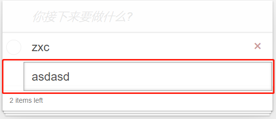
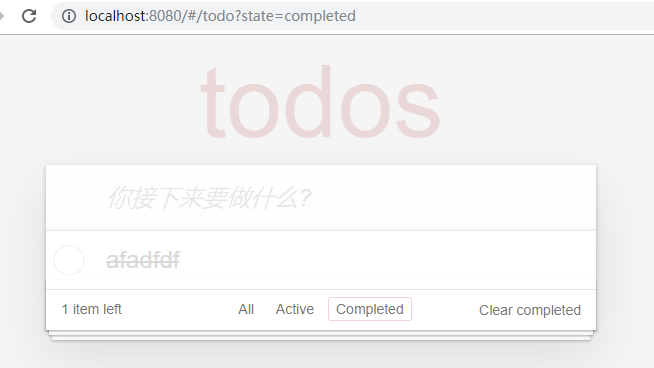
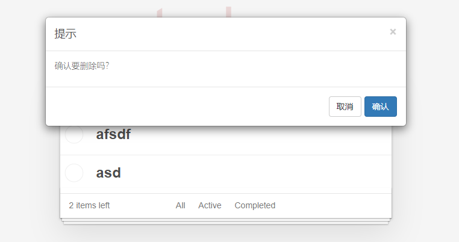

# 实战：Todo List 从组件到应用
前面我们介绍了 Vue 实例、组件、指令、Vue Router 等，大家也知道了 Vue 提供的很多便捷能力，那我们在实际项目中要怎么把这些功能使用起来呢？

这种时候，当然是要拿 Todo List 来讲解了。至于 Todo List 的样式我们这里就不自己设计了，直接使用 Github 上开源的 TodoMVC（地址：https://github.com/tastejs/todomvc） 来完成。这个开源项目里包括了各个框架的代码示例，当然也有Vue.js的示例，但如果直接拿来使用，就达不到我们自己开发的目的了。所以这里我们只使用他们的样式，而功能自己一步步设计和开发。

## 1. 单组件 Todo List
如果是一个简单的 Todo List 的 UI 功能，一般来说我们只需要一个 Vue 组件就可以完成。

### 1. Todo List 实现
我们先来设计最基础的功能，Todo List 一般用来记录备忘的，最简单的功能包括（如图 8-1）：
1. 新增一条备忘。
2. 修改该条备忘。
3. 选择/全选删除某条备忘。
4. 将某条备忘设置成已完成。
5. 快速删除已完成的备忘。


#### 1. 设计数据结构
这个界面中，我们需要有以下的数据：备忘列表、新增备忘内容和修改中的备忘信息，我们在`data`中添加每个数据对应的变量：
```js
export default {
  // ...其他配置
  data() {
    return {
      todos: [], // 所有的备忘列表
      newTodo: "", // 新增的备忘
      editedTodo: {} // 修改中的备忘
    };
  }
};
```
备忘列表`todos`用数组实现，新增备忘内容`newTodo`直接用字符串来表示，而修改中的备忘`editedTodo`由于需要维护修改中的备忘信息，可以用对象来表示。

#### 2. 页面逻辑与交互实现
设计了页面的数据结构之后，我们就可以一个一个地进行功能设计和实现，根据前面罗列的 Todo List 基本功能，我们可以分成三个步骤来实现：
1. 实现新增备忘。
2. 实现备忘列表管理，包括编辑、删除等功能。
3. 实现计算与快速移除已完成备忘数。

##### 1. 新增的备忘。

首先我们来实现备忘新增的能力，需要用到`newTodo`和`todos`两个变量。`newTodo`用来存储我们正在默认输入框中输入的内容，同时当用户按下 Enter 键的时候（可以使用`@keyup.enter`绑定事件），我们就自动将新的备忘添加到备忘列表`todos`中：

```html
<!-- 输入备忘，使用 v-model 绑定 newTodo -->
<!-- 监听 keyup 事件，同时使用修饰器 .enter，按 Enter 键时事件才触发 -->
<input
  class="new-todo"
  placeholder="你接下来要做什么?"
  v-model="newTodo"
  @keyup.enter="addTodo"
/>
```
```js
let id = 1;
export default {
  // 其他选项省略
  methods: {
    // 新增备忘
    addTodo() {
      // 内容为空则不处理
      if (!this.newTodo) {
        return;
      }
      // 往备忘列表中新增一条
      // 最后新增的备忘插在最前面，所以使用 unshift 而不是 push
      this.todos.unshift({
        id: id++, // id 自增
        title: this.newTodo,
        completed: false
      });
      // 添加成功后，清空输入框，方便重新输入
      this.newTodo = "";
    }
  }
};
```
#### 2. 备忘列表管理。

已添加的备忘会展示在列表里，我们可以对它们进行选择、删除、（双击）修改等操作。我们可以在模板中绑定事件：
```html
<!-- 查看所有备忘 -->
<!-- v-for 遍历所有备忘，key 绑定备忘 id，class 绑定样式 -->
<li
  v-for="todo in todos"
  class="todo"
  :key="todo.id"
  :class="{ completed: todo.completed, editing: todo.id == editedTodo.id }"
>
  <div class="view">
    <!-- 选择某条备忘 -->
    <!-- v-model 绑定是否选中 -->
    <input class="toggle" type="checkbox" v-model="todo.completed" />
    <!-- 双击可操作备忘 -->
    <label @dblclick="editTodo(todo)">{{ todo.title }}</label>
    <!-- 删除某条备忘 -->
    <button class="destroy" @click="removeTodo(todo)"></button>
  </div>
  <!-- 修改备忘的数据，失焦或 Enter 键可更新数据，Esc键取消更新 -->
  <input
    class="edit"
    type="text"
    v-model="editedTodo.title"
    @blur="doneEdit(editedTodo)"
    @keyup.enter="doneEdit(editedTodo)"
    @keyup.esc="cancelEdit()"
  />
</li>
```
然后我们来一一实现编辑、删除等方法：
```js
export default {
  // 其他选项省略
  methods: {
    // 编辑备忘
    editTodo(todo) {
      // 将待编辑的内容填充到修改的内容中
      // 使用 ... 解构，相当于使用 Object.assign，属于浅拷贝
      // 此处对象只有一层，浅拷贝足矣
      this.editedTodo = { ...todo };
    },
    // 确认修改备忘
    doneEdit(todo) {
      // 将编辑中内容更新到列表中
      this.todos = this.todos.map(x => {
        return todo.id == x.id ? { ...todo } : { ...x };
      });
      // 清空编辑对象
      this.editedTodo = {};
    },
    // 取消修改备忘
    cancelEdit() {
      this.editedTodo = {};
    },
    // 删除备忘
    removeTodo(todo) {
      // 匹配 id 找出该备忘，然后移除
      const index = this.todos.findIndex(x => x.id === todo.id);
      this.todos.splice(index, 1);
    }
  }
};
```
#### 3. 计算与快速移除已完成备忘数。

前面第三章介绍了 Vue 的基本概念，计算属性 computed 与过滤器 filter 的使用，可以用来计算当前剩下的未完成备忘数，以及根据数量来控制单位是否复数（用于单位计算）：
```html
<footer class="footer" v-show="todos.length">
  <span class="todo-count">
    <!-- remaining 计算剩余的未完成的数量，pluralize 用来过滤单位是否要负数 -->
    <strong>{{ remaining }}</strong> {{ remaining | pluralize }} left
  </span>
  <!-- 当有已完成的备忘时，一键移除已完成按钮出现 -->
  <button
    class="clear-completed"
    @click="removeCompleted"
    v-show="todos.length > remaining"
  >
    Clear completed
  </button>
</footer>
```
同时我们还要实现一键删除已完成备忘的功能：
```js
export default {
  // 其他选项省略
  computed: {
    // 计算剩余未完成的备忘
    remaining() {
      // 过滤掉已完成的，获取数量
      return this.todos.filter(x => !x.completed).length;
    }
  },
  filters: {
    // 计算单位
    pluralize(num) {
      // 如果是多个，则加复数
      return num > 1 ? "items" : "item";
    }
  },
  methods: {
    // 删除已完成的备忘
    removeCompleted() {
      this.todos = this.todos.filter(x => !x.completed);
    }
  }
};
```
到这里，Vue 中常用的语法和选项我们都基本上用上了，包括指令`v-for`、`v-if/v-show`、`v-model`，同时还有 class 的绑定、Vue 实例的 `computed`、`filters` 等，这些在我们开发中是最基本的一些能力，要熟练掌握它们的使用范围和方式。

上面介绍的是一些 Todo List 基本功能的实现，下面我们要讲解一些自定义指令、自定义组件和动画相关的内容。

### 2. v-autofocus 指令
前面讲解自定义指令的时候，我们介绍了官方的一个自动聚焦的能力，在这里我们也可以用上：
```js
export default {
  // 其他选项省略
  directives: {
    autofocus: {
      // 被绑定元素插入父节点时调用 (仅保证父节点存在，但不一定已被插入文档中)
      inserted: function(el) {
        // el: 指令所绑定的元素，可以用来直接操作 DOM
        el.focus();
      }
    }
  }
};
```
因为是在`inserted`钩子中使用，所以我们需要触发元素插入的逻辑，可以通过添加`v-if`来触发：
```html
<!-- 修改备忘的数据，失焦或 Enter 键可更新数据，Esc键取消更新 -->
<!-- v-autofocus 添加自动聚焦功能，结合 v-if 使用来获得编辑时候自动聚焦的效果 -->
<input
  class="edit"
  type="text"
  v-model="editedTodo.title"
  v-autofocus
  v-if="todo.id == editedTodo.id"
  @blur="doneEdit(editedTodo)"
  @keyup.enter="doneEdit(editedTodo)"
  @keyup.esc="cancelEdit()"
/>
```
同时，我们也需要在页面打开的时候，自动聚焦到新增备忘的输入框中：
```html
<!-- 监听 keyup 事件，同时使用修饰器 .enter，按 Enter 键时事件才触发 -->
<input
  class="new-todo"
  placeholder="你接下来要做什么?"
  v-model="newTodo"
  v-autofocus
  @keyup.enter="addTodo"
/>
```
### 3. 自定义组件使用
这里我们的备忘列表中，每个备忘都包括了内容、选择、编辑、删除等功能，根据组件划分的原则（详见第5章），我们可以将它单独抽象成一个组件：
1. 维护自身的编辑中状态。
2. 更新备忘内容、勾选已完成，都自行更新备忘状态。
3. 删除当前备忘，需要通知父组件进行删除。




在这里，由于需要自行更新备忘内容和勾选状态，也就是`title`和`completed`，我们需要对`todo`进行“双向绑定”。但是真正的双向绑定会带来维护上的问题，因为子组件可以修改父组件，且在父组件和子组件都没有明显的改动来源。这种情况下，我们可以使用`update:myPropName`的模式触发事件取而代之。

我们来看看这个组件的实现：

```html
<template>
  <div :class="{editing: isEdited }">
    <div class="view">
      <!-- 选择某条备忘 -->
      <!-- v-model 绑定是否选中 -->
      <input
        class="toggle"
        type="checkbox"
        @change="updateChecked($event.target.checked)"
      />
      <!-- 双击可操作备忘 -->
      <label @dblclick="editTodo(todo)">{{ title }}</label>
      <!-- 删除某条备忘 -->
      <button class="destroy" @click="removeTodo(todo)"></button>
    </div>
    <!-- 修改备忘的数据，失焦或 Enter 键可更新数据，Esc键取消更新 -->
    <input
      class="edit"
      type="text"
      v-model="editingTitle"
      v-autofocus
      v-if="isEdited"
      @blur="doneEdit()"
      @keyup.enter="doneEdit()"
      @keyup.esc="cancelEdit()"
    />
  </div>
</template>

<script>
  export default {
    data() {
      return {
        isEdited: false, // 是否在编辑中中状态
        editingTitle: "" // 编辑中内容
      };
    },
    props: {
      // 备忘内容
      title: {
        type: String,
        default: ""
      },
      // 备忘勾选（已完成）状态
      completed: {
        type: Boolean,
        default: false
      }
    },
    methods: {
      // 编辑备忘
      editTodo() {
        this.editingTitle = this.title;
        this.isEdited = true;
      },
      // 确认修改备忘
      doneEdit() {
        // ESC 按键也会触发 blur 事件，故需要判断原有状态是否是编辑中
        if (this.isEdited) {
          // 更新绑定的 title
          this.$emit("update:title", this.editingTitle);
          this.isEdited = false;
        }
      },
      // 取消修改备忘
      cancelEdit() {
        // 取消编辑中状态
        this.isEdited = false;
      },
      // 更新选中状态
      updateChecked(completed) {
        // 更新绑定的 completed
        this.$emit("update:completed", completed);
      },
      // 删除备忘
      removeTodo() {
        // 通知父组件删除
        this.$emit("delete");
      }
    }
  };
</script>
<style>
  /* 由于改动了原有样式结构，所以需要改变对应的 CSS 选择器的结构 */
  .todo-list li .editing .view {
    display: none;
  }
  .todo-list li .editing .edit {
    display: block;
    width: 506px;
    padding: 12px 16px;
    margin: 0 0 0 43px;
  }
</style>
```
这里我们用`this.$emit('update:title', newTitle)`方法表达对其赋新值的意图，父组件可以这样监听事件并根据更新一个对应的数据：
```html
<todo-item
  v-bind:title="todo.title"
  v-on:update:title="todo.title = $event"
></todo-item>
```
在 Vue 中为了方便起见，我们为这种模式提供一个缩写，即 `.sync` 修饰符：
```html
<todo-item v-bind:title.sync="todo.title"></todo-item>
```
所以，在父组件中我们就可以这样使用这个组件：
```html
<!-- 查看所有备忘 -->
<!-- v-for 遍历所有备忘，key 绑定备忘 id，class 绑定样式 -->
<li
  v-for="todo in todos"
  class="todo"
  :key="todo.id"
  :class="{ completed: todo.completed }"
>
  <!-- 使用 todo-item 组件 -->
  <!-- “双向绑定”备忘内容 title 和备忘已完成状态 completed -->
  <!-- 监听 delete 事件 -->
  <todo-item
    v-bind:title.sync="todo.title"
    v-bind:completed.sync="todo.completed"
    @delete="removeTodo(todo)"
  ></todo-item>
</li>
```
这样，在父组件中只需要维护一个备忘的新增和删除，其他备忘自己的内容和状态更新都不用管啦：
```js
  // 引入组件方便使用
import TodoItem from "./TodoItem"
export default({
  // 使用自定义组件
  components: {
    "todo-item": TodoItem
  }
  methods: {
    // 删除备忘
    removeTodo(todo){
      // 匹配 id 找出该备忘，然后移除
      const index = this.todos.findIndex(x => x.id === todo.id)
      this.todos.splice(index, 1)
    }
  }
})
```
### 4. 过渡动画
当我们备忘过多的时候，为了避免输入重复的内容，我们可以在输入的过程中，自动匹配已存在的内容：
```js
export default {
  // 其他选项省略
  computed: {
    // 计算匹配的备忘
    computedTodos() {
      // 过滤展示匹配的内容
      return this.todos.filter(item => {
        return (
          item.title.toLowerCase().indexOf(this.newTodo.toLowerCase()) !== -1
        );
      });
    }
  }
};
```
这个时候，我们可以加个过渡动画，来平滑地展示匹配的内容（关于更多的 Vue 相关动画效果，请参考[第6章](https://godbasin.github.io/vue-ebook/vue-ebook/6.html)内容）。我们可以直接使用官方提供的 Javascript 钩子方式就可以：
```html
<!-- 添加 before-enter、enter 和 leave 的钩子 -->
<transition-group
  name="staggered-fade"
  tag="ul"
  v-bind:css="false"
  v-on:before-enter="beforeEnter"
  v-on:enter="enter"
  v-on:leave="leave"
  class="todo-list"
>
  <!-- v-for 遍历匹配中的备忘 computedTodos，key 绑定备忘 id，class 绑定样式 -->
  <li
    v-for="todo in computedTodos"
    class="todo"
    :key="todo.id"
    :class="{ completed: todo.completed }"
  >
    <!-- 此处省略 -->
  </li>
</transition-group>
```
```js
export default {
  // 其他选项省略
  methods: {
    // 进入中
    beforeEnter(el) {
      el.style.opacity = 0;
      el.style.height = 0;
    },
    enter(el, done) {
      // 设置延时
      var delay = el.dataset.index * 150;
      setTimeout(function() {
        // 更新元素样式
        Velocity(el, { opacity: 1, height: "58px" }, { complete: done });
      }, delay);
    },
    // 离开时
    leave(el, done) {
      // 设置延时
      var delay = el.dataset.index * 150;
      setTimeout(function() {
        // 更新元素样式
        Velocity(el, { opacity: 0, height: 0 }, { complete: done });
      }, delay);
    }
  }
};
```
这样，我们就能有个备忘筛选匹配的过渡效果了。

## 2. 单页应用 Todo List
基于这里开始，我们会使用到更多的组件、以及路由，所以我们使用 Vue CLI 脚手架来本地构建吧。脚手架的安装和使用已经在第2章详细讲解了，这里我们就略过不说啦。

### 2. 使用 Vue Router
如果是单组件的页面话，我们在各种切换状态的过程中不会更新到 URL。这样有个不好的地方是，当我们刷新页面的时候，就会丢失当前的页面状态，这样用户体验会比较差，所以这里我们加上 Vue Router 路由来进行路由相关的处理。

#### 使用 query 作为参数
我们给当前的 Todo List 增加一个状态过滤，来切换展示已完成、未完成、全部的备忘，所以其实我们路由配置只需要配一个页面的路由，状态使用`query`来传参就可以了：
```js
import Todo from "pages/Todo.vue";
// 配置路由信息
const routes = [
  { path: "/todo", component: Todo, name: "Todo" },
  // 通配符 * 会匹配所有路径
  { path: "*", redirect: { name: "Todo" } }
];
```
同时，我们需要给几个 Tab 添加激活状态：
```html
<ul class="filters">
  <!-- exact 设置精确匹配，active-class 设置激活状态 -->
  <li>
    <router-link :to="{query: {state: ''}}" active-class="selected" exact
      >All</router-link
    >
  </li>
  <li>
    <router-link :to="{query: {state: 'active'}}" active-class="selected" exact
      >Active</router-link
    >
  </li>
  <li>
    <router-link
      :to="{query: {state: 'completed'}}"
      active-class="selected"
      exact
      >Completed</router-link
    >
  </li>
</ul>
```
当然，我们计算当前列表的时候，就加上状态过滤就好了：
```js
export default {
  // 其他选项省略
  computed: {
    // 计算当前可见的备忘
    computedTodos() {
      // 先过滤状态
      // this.$route 可以获取当前路由信息
      const state = this.$route.query.state;
      const filterTodos = this.todos.filter(x => {
        if (state === "active") {
          return !x.completed;
        } else if (state === "completed") {
          return x.completed;
        } else {
          return true;
        }
      });
      // 再过滤展示匹配的内容
      return filterTodos.filter(item => {
        return (
          item.title.toLowerCase().indexOf(this.newTodo.toLowerCase()) !== -1
        );
      });
    }
  }
};
```
这样调整之后，我们最终的效果如图：



#### 使用缓存
如果说我们希望刷新页面之后，原本的备忘还在，这个时候我们就需要把内容写到缓存里。这里我们使用`localStorage`来存储：
```js
export default {
  // 其他选项省略
  data() {
    return {
      // 初始化的时候，获取下本地的缓存
      todos: JSON.parse(localStorage.getItem("todos") || "[]") // 所有的备忘
    };
  },
  watch: {
    // 侦听 todos 的变化
    todos(newVal) {
      // 每次更新写入缓存
      localStorage.setItem("todos", JSON.stringify(newVal));
    }
  }
};
```
这样，我们在初始化组件（页面）的时候，就从本地缓存获取。而当我们每次更新备忘数据的时候，也同步写到缓存里，这样就很方便了。关于缓存，除了 `localStorage` 之外，还可以使用 sessionStorage。不同之处在于 `localStorage` 里面存储的数据没有过期时间设置，而存储在 `sessionStorage` 里面的数据在页面会话结束（当前浏览器标签关闭）时会被清除。

### 3. Promise 与异步组件
在很多 Web 应用中，基本上都会有弹窗需要用户确认的交互。在很久以前，我们会使用浏览器原生的`window.alert`、`window.confirm`来获取用户反馈。但是这种方法存在两个问题：
1. Javascript 单线程会卡住等待，会阻塞其他逻辑的执行（例如要下载数据）。
2. 实在太丑了。

所以现在我们一般都会自己做一个弹窗，但是自己做的弹窗就会有另外的问题。例如我们在用户点击删除按钮的时候，需要用户进行二次确认。但是如果是自己做的一个弹窗，如果不使用等待回调的方式，逻辑是会继续往后执行，可能出现的结果就是用户还没确认，就被删掉了，这个弹窗形同虚设：
```JS
waitForConfirm(); // 等待确认
// 由于 Javascript 函数执行是异步的，所以下面的函数会继续执行
// 结果：上面的等待过程形同虚设，删除逻辑会直接执行
deleteSomething(); // 删除
```
最好的方式是通过 Promise 来进行弹窗，要实现使用 Promise，需要监听用户的确认或取消的，然后通过`reject`或是`resolve`来继续处理后续逻辑。一般来说，我们可以有几种方式：
1. 使用全局状态管理工具，例如 Vuex。
2. 使用事件监听`vm.$emit`和`vm.$on`。

这里由于我们还没讲到 Vuex，所以先直接使用事件监听的方法来做，Vuex 的方法可参考[《第11章 全局数据管理与 Vuex》](https://godbasin.github.io/vue-ebook/vue-ebook/11.html)。

#### 1. 全局事件
Vue 实例提供了事件的触发和监听，如果我们想要全局的方式来进行通信，可以直接获取最外层的 Vue 实例：
```js
// main.js
// 默认 export 该 Vue 实例
export default new Vue({
  el: "#app",
  router, // 传入路由能力
  render: h => h(App)
});
```
然后我们就可以提供一个公共函数方法来触发：
```js
// confirm.js
// 获取该实例
import vm from "../main";

// 传入标题、内容、确认按钮和取消按钮的文案
export function confirmDialog({ title, text, cancelText, confirmText }) {
  return new Promise((resolve, reject) => {
    // 把 reject 和 resolve 通过 $emit 事件传参带过去，方便进行 Promise 状态扭转
    vm.$emit("setDialog", {
      title,
      text,
      cancelText,
      confirmText,
      resolve,
      reject
    });
  });
}

export default confirmDialog;
```
#### 2. 设计弹窗
现在提供了这样的事件触发，我们需要提供一个弹窗的组件。这里我们直接从 Bootstrap 拿一个弹窗的样式过来，Javascript 的逻辑文件就不用下载啦，我们自己控制就好
```html
<!-- ConfirmDialog.vue -->
<template>
  <!-- 强制出现 display: block -->
  <div class="modal" tabindex="-1" role="dialog" style="display: block">
    <div class="modal-dialog" role="document">
      <div class="modal-content">
        <div class="modal-header">
          <button type="button" class="close" aria-label="Close">
            <span aria-hidden="true">&times;</span>
          </button>
          <!-- 弹窗标题 -->
          <h4 class="modal-title">{{dialogInfo.title || '提示'}}</h4>
        </div>
        <div class="modal-body">
          <!-- 弹窗内容 -->
          <p>{{dialogInfo.text}}</p>
        </div>
        <div class="modal-footer">
          <!-- 取消按钮，点击取消，cancelText 可设置按钮文案 -->
          <button type="button" class="btn btn-default" @click="cancel()">
            {{dialogInfo.cancelText || '取消'}}
          </button>
          <!-- 确认按钮，点击确认，confirmText 可设置按钮文案 -->
          <button type="button" class="btn btn-primary" @click="confirm()">
            {{dialogInfo.confirmText || '确认'}}
          </button>
        </div>
      </div>
    </div>
  </div>
</template>

<script>
  import vm from "../main";
  export default {
    props: {
      // 弹窗相关信息
      dialogInfo: {
        type: Object,
        default: () => {}
      }
    },
    methods: {
      // 点击取消
      cancel() {
        // 要先判断下 reject 方法在不在
        if (this.dialogInfo.reject) {
          // 取消就 reject 掉呀
          this.dialogInfo.reject();
          // 触发 done 事件，方便后续弹窗关闭、移除等逻辑处理
          this.$emit("done");
        }
      },
      // 点击确认
      confirm() {
        // 要先判断下 resolve 方法在不在
        if (this.dialogInfo.resolve) {
          // 确认就 resolve 掉
          this.dialogInfo.resolve();
          // 触发 done 事件，方便后续弹窗关闭、移除等逻辑处理
          this.$emit("done");
        }
      }
    }
  };
</script>
<style scoped>
  /* scoped：该组件中局部引入 bootstrap 样式，不影响全局样式 */
  @import "https://cdn.jsdelivr.net/npm/bootstrap@3.3.7/dist/css/bootstrap.min.css";
</style>
这里能看到，我们通过 Prop 传入dialogInfo，里面除了标题、内容、按钮文案，还包括了前面说到的resolve和reject方法。这里会在用户点击确认或者取消的时候调用对应的方法，就可以正常地处理后面的相关逻辑了。同时这里还在用户响应的时候，使用this.$emit("done")触发了名为done的事件，父组件可以监听并进行其他的逻辑处理。

#3. 最外层组件注入
现在我们已经有了可用的弹窗组件，也有了传入参数、触发事件的confirmDialog方法。那么我们要实现的还剩下：
(1) 监听setDialog事件，并获取对应的传参数据。
(2) 事件触发的时候，添加弹窗。

这里通过每次监听到setDialog事件的时候，都新增一个弹窗的方式，可以支持同时多个弹窗的交互确认：

<!-- App.vue -->
<template>
  <div>
    <!-- 使用 <router-view></router-view> 来渲染最高级路由匹配到的组件 -->
    <router-view></router-view>
    <!-- 动态组件由 vm 实例的 component 控制 -->
    <!-- done 事件绑定用户操作完毕 -->
    <component
      v-for="(item, index) in items"
      :key="index"
      :is="item.component"
      :dialogInfo="item.dialogInfo"
      @done="doneDialog(index)"
    ></component>
  </div>
</template>

<script>
  // 弹窗组件
  import ConfirmDialog from "./components/ConfirmDialog";
  // 获取 Vue 实例
  import vm from "./main";

  export default {
    name: "app",
    data() {
      return {
        items: []
      };
    },
    mounted() {
      // 如果在这里，首次加载页面的时候，无法正确获取到 Vue 实例
      // DOM 还没有更新
      this.$nextTick(() => {
        // DOM 现在更新了
        vm.$on("setDialog", dialogInfo => {
          // 将弹窗相关信息、弹窗组件添加进 component 数组中
          this.items.push({ dialogInfo, component: ConfirmDialog });
        });
      });
    },
    methods: {
      doneDialog(index) {
        // 用户已经点击了该弹窗，可以从列表中移除了
        this.items.splice(index, 1);
      }
    }
  };
</script>
```
这里我们用到了一个前面没有讲过的内置组件`<component></component>`，它渲染一个“元组件”为动态组件。根据is的值，来决定哪个组件被渲染，例如这里我们的`is`绑定了 `ComformDialog` 组件。

#### 4. 拉起弹窗
前面我们已经把基础的组件和方法、环境都搭建好了，现在我们只需要像正常的异步 Promise 一样去使用就可以了：`
```js
import confirmDialog from "../utils/comfirm";
export default {
  // 省略其他的选项
  methods: {
    // 删除备忘
    removeTodo() {
      // 传入弹窗的内容，并通过 then 和 catch 来获取用户的操作，以便继续后续的逻辑处理
      confirmDialog({
        text: "确认要删除吗？"
      })
        .then(res => {
          // 用户点击确认
          // 通知父组件删除
          this.$emit("delete");
        })
        .catch(() => {
          // 用户点击取消
          console.log("用户点击了取消");
        });
    }
  }
};
```
最终效果如图 8-4:


到这里，我们已经将这个 Todo List 玩得出神入化了。如果是更大一点的项目，其实还会需要状态管理的工具（例如 Vuex 等）。如果使用了 Vuex，还可以使用 Store 来更新弹窗的状态，就不需要这种事件监听的复杂方法啦。

关于状态管理的，会在[《第11章 全局数据管理与 Vuex》](https://godbasin.github.io/vue-ebook/vue-ebook/11.html)讲述。到这里为止，我们已经介绍了 Vue 中大部分的概念和常用 API、实例选项等，在规模不大的项目中已经足够用了。而第一部分的内容也到这，第二部分的内容更多的是多人合作的项目、较大型项目的一些开发和管理经验，同时还有很多实战经验沉淀下来的一些思维方法，可以提升开发效率和降低维护成本噢。