圣杯布局和双飞翼布局是前端工程师需要日常掌握的重要布局方式。两者的功能相同，都是为了实现一个**两侧宽度固定，中间宽度自适应的三栏布局**。

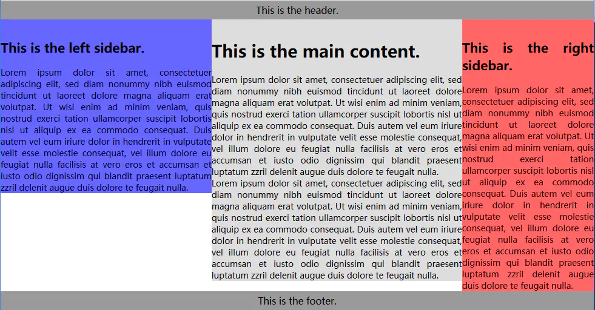

圣杯布局与双飞翼布局


圣杯布局来源于文章[In Search of the Holy Grail](https://alistapart.com/article/holygrail)，而双飞翼布局来源于淘宝UED。虽然两者的实现方法略有差异，不过都遵循了以下要点：

- 两侧宽度固定，中间宽度自适应
- 中间部分在DOM结构上优先，以便先行渲染
- 允许三列中的任意一列成为最高列
- 只需要使用一个额外的``标签

下面我将依次介绍圣杯布局和双飞翼布局的实现方法，并在最后根据个人思考对原有方法做出一些修改，给出其它一些可行的方案。

## 圣杯布局

### 1. DOM结构
```html
<div id="header"></div>
<div id="container">
  <div id="center" class="column"></div>
  <div id="left" class="column"></div>
  <div id="right" class="column"></div>
</div>
<div id="footer"></div>
```
首先定义出整个布局的DOM结构，主体部分是由`container`包裹的`center`,`left`,`right`三列，其中`center`定义在最前面。

### 2. CSS代码

假设左侧的固定宽度为200px，右侧的固定宽度为150px，则首先在`container`上设置：
```css
#container {
  padding-left: 200px; 
  padding-right: 150px;
}
```
为左右两列预留出相应的空间，得到如下示意图：

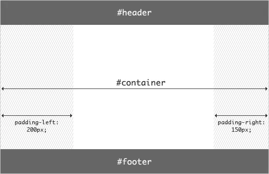

创建布局框架

随后分别为三列设置宽度与浮动，同时对`footer`设置清除浮动：
```css
#container .column {
  float: left;
}

#center {
  width: 100%;
}

#left {
  width: 200px; 
}

#right {
  width: 150px; 
}

#footer {
  clear: both;
}
```
得到如下效果：

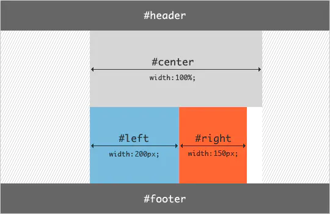

设置宽度和清除浮动

根据浮动的特性，由于`center`的宽度为100%，即占据了第一行的所有空间，所以`left`和`right`被“挤”到了第二行。

接下来的工作是将`left`放置到之前预留出的位置上，这里使用 **[负外边距](https://www.cnblogs.com/2050/archive/2012/08/13/2636467.html)（nagetive margin）**：

```css
#left {
  width: 200px; 
  margin-left: -100%;
}
```
得到：

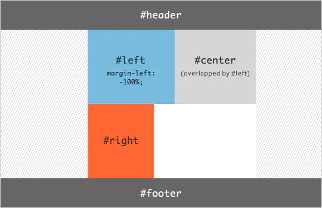

将left移动到预留位置-1

随后还需要使用 **定位(position)** 方法：
```css
#left {
  width: 200px; 
  margin-left: -100%;
  position: relative;
  right: 200px;
}
```
这里使用`position: relative`和`right: 200px`将`left`的位置在原有位置基础上左移200px，以完成`left`的放置：

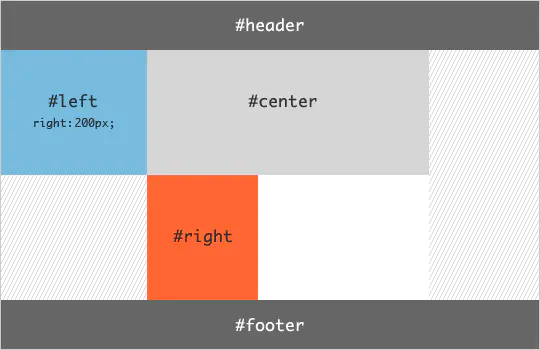


将left移动到预留位置-2

接下来放置`right`，只需添加一条声明即可：

```css
#right {
  width: 150px; 
  margin-right: -150px; 
}
```

得到最终的效果图：


将right移动到预留位置

至此，布局效果完成。不过还需要考虑最后一步，那就是 **页面的最小宽度** ：要想保证该布局效果正常显示，由于两侧都具有固定的宽度，所以需要给定页面一个最小的宽度，但这并不只是简单的200+150=350px。回想之前`left`使用了`position: relative`，所以就意味着在`center`开始的区域，还存在着一个`left`的宽度。所以页面的最小宽度应该设置为`200+150+200=550px`：
```css
body {
  min-width: 550px;
}
```
综上所述，圣杯布局的CSS代码为：
```css
body {
  min-width: 550px;
}

#container {
  padding-left: 200px; 
  padding-right: 150px;
}

#container .column {
  float: left;
}

#center {
  width: 100%;
}

#left {
  width: 200px; 
  margin-left: -100%;
  position: relative;
  right: 200px;
}

#right {
  width: 150px; 
  margin-right: -150px; 
}

#footer {
  clear: both;
}
```
关于圣杯布局的示例，可参考：[圣杯布局](https://litaooooo.github.io/page-examples/holy-grail.html)

最后提醒一下很多朋友可能会忽略的小细节：在`#center`中，包含了一条声明`width: 100%`，这是中间栏能够做到自适应的关键。可能会有朋友认为不需要设置这条声明，因为觉得`center`在不设置宽度的情况下会默认将宽度设置为父元素(`container`)的100%宽度。但需要注意到，`center`是浮动元素，由于浮动具有**包裹性**，在不显式设置宽度的情况下会自动“收缩”到内容的尺寸大小。如果去掉`width: 100%`，则当中间栏不包含或者包含较少内容时，整个布局会“崩掉”，而达不到这样的效果：

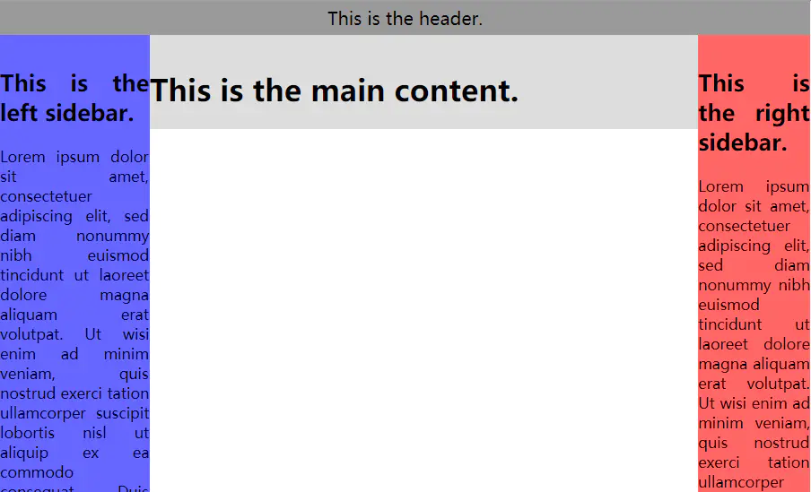

中间栏仅包含较少内容

## 双飞翼布局

### 1. DOM结构
```html
<body>
  <div id="header"></div>
  <div id="container" class="column">
    <div id="center"></div>
  </div>
  <div id="left" class="column"></div>
  <div id="right" class="column"></div>
  <div id="footer"></div>
<body>
```
双飞翼布局的DOM结构与圣杯布局的区别是用`container`仅包裹住`center`，另外将`.column`类从`center`移至`container`上。

### 2. CSS代码

按照与圣杯布局相同的思路，首先设置各列的宽度与浮动，并且为左右两列预留出空间，以及为`footer`设置浮动清除：
```css
#container {
  width: 100%;
}

.column {
  float: left;
}

#center {
  margin-left: 200px;
  margin-right: 150px;
}

#left {
  width: 200px; 
}

#right {
  width: 150px; 
}

#footer {
  clear: both;
}
```
得到如下效果示意图：

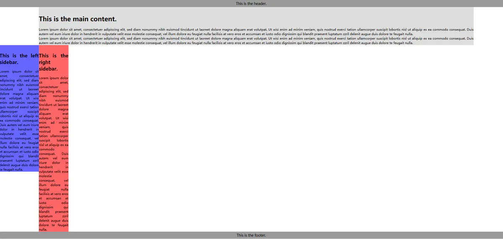

双飞翼布局初始设置

以上代码将`container`,`left`,`right`设置为`float: left`，而在`container`内部，`center`由于没有设置浮动，所以其宽度默认为`container`的100%宽度，通过对其设置`margin-left`和`margin-right`为左右两列预留出了空间。

将`left`放置到预留位置：
```css
#left {
  width: 200px; 
  margin-left: -100%;
}
```
得到：

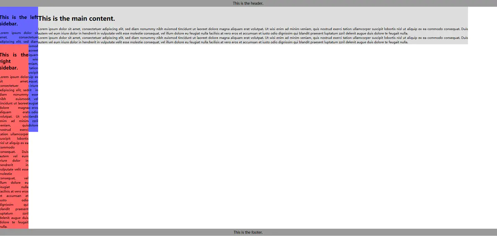

放置left到预留位置

将`right`放置到预留位置：
```css
#right {
  width: 150px; 
  margin-left: -150px;
}
```
得到最终效果：

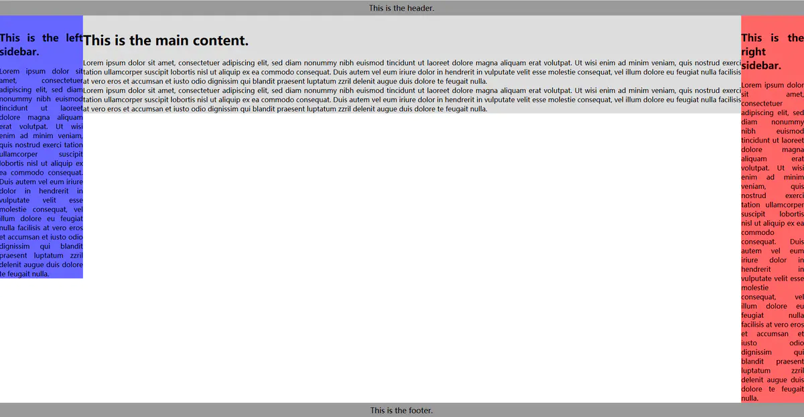

双飞翼布局最终效果

最后计算最小页面宽度：由于双飞翼布局没有用到`position:relative`进行定位，所以最小页面宽度应该为`200+150=350px`。但是当页面宽度缩小到350px附近时，会挤占中间栏的宽度，使得其内容被右侧栏覆盖，如下所示：

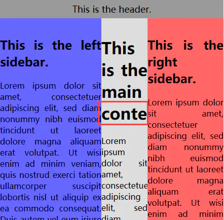

中间栏内容被覆盖

因此在设置最小页面宽度时，应该适当增加一些宽度以供中间栏使用（假设为150px），则有：


```css
body {
  min-width: 500px;
}
```
至此双飞翼布局大功告成！其布局整体代码为：
```css
body {
  min-width: 500px;
}

#container {
  width: 100%;
}

.column {
  float: left;
}
        
#center {
  margin-left: 200px;
  margin-right: 150px;
}
        
#left {
  width: 200px; 
  margin-left: -100%;
}
        
#right {
  width: 150px; 
  margin-left: -150px;
}
        
#footer {
  clear: both;
}
```
关于双飞翼布局的示例，可参考：[双飞翼布局](https://litaooooo.github.io/page-examples/double-wings.html)

## 总结与思考

通过对圣杯布局和双飞翼布局的介绍可以看出，圣杯布局在DOM结构上显得更加直观和自然，且在日常开发过程中，更容易形成这样的DOM结构（通常`<aside>`和`<article>`/`<section>`一起被嵌套在`<main>`中）；而双飞翼布局在实现上由于不需要使用定位，所以更加简洁，且允许的页面最小宽度通常比圣杯布局更小。

其实通过思考不难发现，两者在代码实现上都额外引入了一个`<div>`标签，其目的都是为了既能保证中间栏产生浮动（浮动后还必须显式设置宽度），又能限制自身宽度为两侧栏留出空间。

从这个角度出发，如果去掉额外添加的`<div>`标签，能否完成相同的布局呢？答案是肯定的，不过这需要在兼容性上做出牺牲：

### DOM结构
```html
<div id="header"></div>
<div id="center" class="column"></div>
<div id="left" class="column"></div>
<div id="right" class="column"></div>
<div id="footer"></div>
```
去掉额外的`<div>`标签后，得到的DOM结构如上所示，基于双飞翼布局的实现思路，只需要在center上做出修改：

#### 1. 使用calc()
```css
.column {
  float: left;
}
    
#center {
  margin-left: 200px;
  margin-right: 150px;
  width: calc(100% - 350px);
}
```
通过`calc()`可以十分方便地计算出`center`应该占据的自适应宽度，目前`calc()`支持到IE9。

#### 2. 使用border-box
```css
.column {
  float: left;
}
    
#center {
  padding-left: 200px;
  padding-right: 150px;
  box-sizing: border-box;
  width: 100%;
}
```
使用`border-box`可以将center的整个盒模型宽度设置为父元素的100%宽度，此时再利用`padding-left`和`padding-right`可以自动得到中间栏的自适应宽度。不过需要注意的是，由于padding是盒子的一部分，所以padding部分会具有中间栏的背景色，当中间栏高于侧栏时，会出现这样的情况：

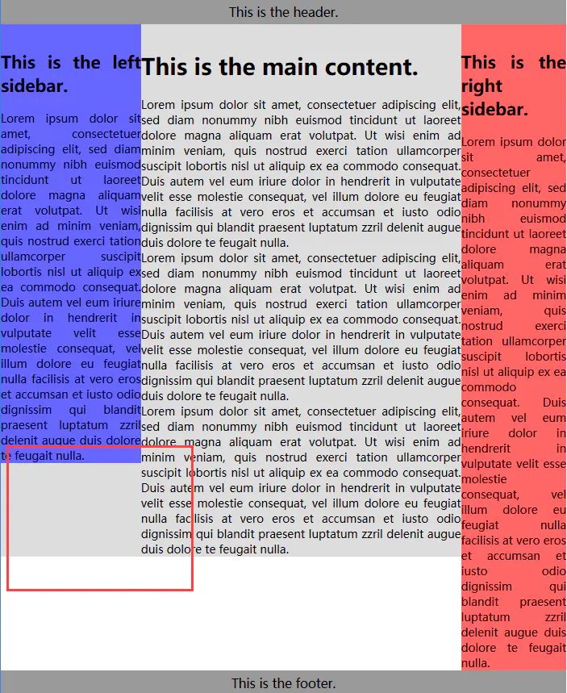

padding背景色影响左侧空间

目前box-sizing支持到**IE8**。

#### 3. 使用flex
这里使用flex还是需要与圣杯布局相同的DOM结构，不过在实现上将更加简单：
```css
<!-- DOM结构 -->
<div id="container">
  <div id="center"></div>
  <div id="left"></div>
  <div id="right"></div>
</div>
```
CSS代码如下：
```css
#container {
    display: flex;
}

#center {
    flex: 1;
}

#left {
    flex: 0 0 200px;
    order: -1;
}

#right {
    flex: 0 0 150px;
}
```