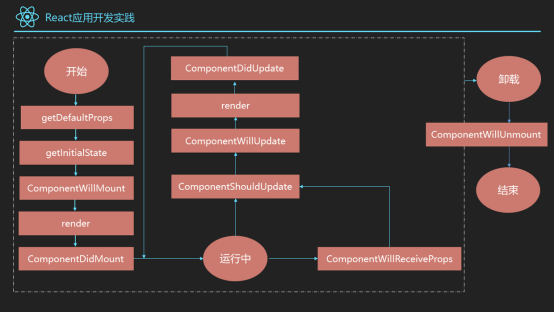

## 介绍一下 react
React 是 一个用于构建用于界面的js库, react主要用于构建ui, 很多人认为react是MVC的v(视图)

React特点有：

1. 声明式设计 −React采用声明范式，可以轻松描述应用。
2. 高效 −React通过对DOM的模拟，最大限度地减少与DOM的交互。
3. 灵活 −React可以与已知的库或框架很好地配合。
4. JSX − JSX 是 JavaScript 语法的扩展。React 开发不一定使用 JSX ，但我们建议使用它。
5. 组件 − 通过 `React` 构建组件，使得代码更加容易得到复用，能够很好的应用在大项目的开发中。
6. 单向响应的数据流 − React 实现了单向响应的数据流，从而减少了重复代码，这也是它为什么比传统数据绑定更简单。

## React单项数据流
在React中，数据是单向流动的，是从上向下的方向，即从父组件到子组件的方向。
state和props是其中重要的概念，如果顶层组件初始化props，那么React会向下遍历整颗组件树，重新渲染相关的子组件。其中state表示的是每个组件中内部的的状态，这些状态只在组件内部改变。

把组件看成是一个函数，那么他接受props作为参数，内部由state作为函数的内部参数，返回一个虚拟dom的实现。

## react生命周期函数和react组件的生命周期
React的组件在第一次挂在的时候首先获取父组件传递的`props`，接着获取初始的`state`值，接着经历挂载阶段的三个生命周期函数，也就是`ComponentWillMount`，`render`，`ComponentDidMount`，这三个函数分别代表组件将会挂载，组件渲染，组件挂载完毕三个阶段，在组件挂载完成后，组件的`props`和`state`的任意改变都会导致组建进入更新状态，在组件更新阶段，如果是`props`改变，则进入`ComponentWillReceiveProps`函数，接着进入`ComponentShouldUpdate`进行判断是否需要更新，如果是`state`改变则直接进入`ComponentShouldUpdate`判定，这个默认是`true`，当判定不需要更新的话，组件继续运行，需要更新的话则依次进入`ComponentWillMount`，`render`，`ComponentDidMount`三个函数，当组件卸载时，会首先进入生命周期函数`ComponentWillUnmount`,之后才进行卸载，如图

React的生命周期函数：

初始化阶段：`getDefaultProps`获取实例的默认属性，`getInitialState`获取每个实例的初始化状态，`ComponentWillMount`：组件将被装载，渲染到页面上，render：组件在这里生成虚拟的DOM节点，`ComponentDidMount`:组件真正被装载之后

运行中状态： `componentWillReceiveProps`:组件将要接收到属性的时候调用 `shouldComponentUpdate:`组件接受到新属性或者新状态的时候（可以返回 `false`，接收数据后不更新，阻止 `render` `调用，后面的函数不会被继续执行了）shouldComponentUpdate` 这个方法用来判断是否需要调用 `render` 方法重新描绘 `dom`。因为 `dom` 的描绘非常消耗性能，如果我们能在 `shouldComponentUpdate` 方法中能够写出更优化的 `dom diff` 算法，可以极大的提高性能。 `componentWillUpdate`:组件即将更新不能修改属性和状态 `render`:组件重新描绘 `componentDidUpdate`:组件已经更新 销毁阶段： `componentWillUnmount`:组件即将销毁

## react和vue的原理, 区别, 亮点, 作用

