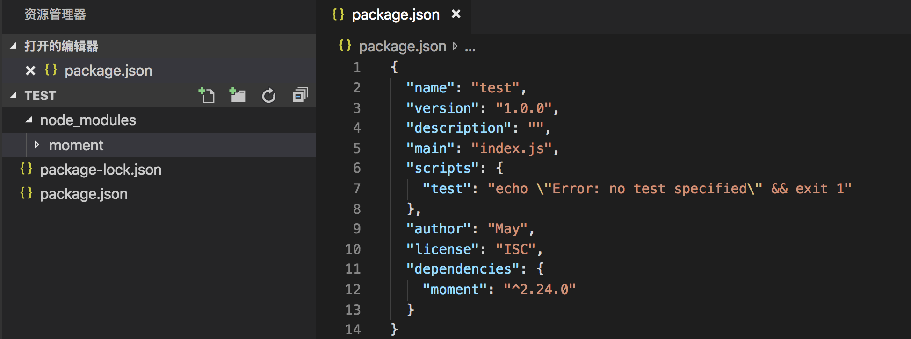

# Node.js 包管理器 NPM 讲解
>立志而无恒，终身事难成。——曾国藩

包管理器又称软件包管理系统，它是在电脑中自动安装、配制、卸载和升级软件包的工具组合，在各种系统软件和应用软件的安装管理中均有广泛应用。对于我们业务开发也很受益，相同的东西不必重复去造轮子。

每个工具或者开发语言都有相应的包管理器，好比 Ubuntu 的 apt-get、Centos 的 yum、Java 的 Maven 仓库等等。Node.js 中目前最出名的包管理器为 NPM 也是生态最好的。

## 什么是 NPM？
NPM 是 Node.js 中的包管理器。允许我们为 Node.js 安装各种模块，这个包管理器为我们提供了安装、删除等其它命令来管理模块。这里有一点我们需要注意，我们必须要有一个 package.json 文件或 node_modules 目录安装模块到本地。

NPM 最好的一点是它会在本地存储我们所安装的依赖项，存在于 package.json 的 dependencies 对象里。例如，如果一个模块 X 使用了模块 A 版本为 1.0，模块 Y 使用了模块 A 版本为 1.5，那么模块 X 或 Y 都将在本地拥有自己对应的模块 A 的副本。
```json
// 模块 X
{
  "name": "X",
  "dependencies": {
    "A": "^1.0"
  }
}
```
```json
// 模块 Y
{
  "name": "Y",
  "dependencies": {
    "A": "^1.5"
  }
}
```
## 什么时候需要 NPM 包？
当我们在开发一些 Node.js 项目时，可能会遇到一些地方需要 NPM，例如链接 Redis、MongoDB 或者发送请求 Request 等，有了这些现有模块可以使我们更专注于业务开发，当然有时你会有些特别的需求，这时可能需要自己去封装一个 NPM 模块，**实现模块复用、资源共享**。
### NPM 安装
NPM 不需要单独安装，在我们安装 Node.js 环境时，NPM 也就安装了，Node.js 环境还没搭建的同学可参考 “3N 兄弟” 助您完成 Node.js 环境搭建 一节。

终端执行 npm -v 命令查看当前 npm 版本
```bash
$ npm -v

5.6.0
```
### NPM 源设置
在国内有时候受限于网络因素的影响，通常在安装一个包管理器之前可以切换为 taobao 源，是的速度可以更快，但是要注意如果是私有模块在 NPM 官方的，则必须切换为官方源，否则会出现 404 错误。

#### 查看当前 npm 源
```bash
npm config get registry
# http://registry.npmjs.org/
```
#### 切换为 taobao 源
```bash
npm config set registry=https://registry.npm.taobao.org
```
#### 切换为 npm 官方源

在 npm publish 的时候 需要切换回 npm 源
```bash
npm config set registry=http://registry.npmjs.org
```
## 如何在项目中应用
让我们新建一个项目 test，刚开始这是一个空的文件夹
### 第一步

控制台执行 npm init，根据提示输入信息，会生成一个 package.json 文件，如下所示：
```json
{
  "name": "test", // 项目名称
  "version": "1.0.0", // 版本号
  "description": "", // 描述
  "main": "index.js", // 入口文件，默认 index.js
  "scripts": {
    "test": "echo \"Error: no test specified\" && exit 1"
  },
  "author": "May", // 作者
  "license": "ISC"
}
```
### 第二步

安装 npm 模块，例如我们安装一个 moment 模块格式化时间，执行以下命令
```bash
npm install moment -S
# or 
npm i moment --save
```
安装成功之后，会生成一个新的目录 node_modules 这是用来存放我们所安装的模块，另外 package.json 也会发生变化多了一个 dependencies 对象，这个是用来存储我们的模块版本信息。
```json
"dependencies": {
  "moment": "^2.24.0"
}
```
看下我们当前的目录结构：



## NPM 注册登录
注册
```bash
$ npm adduser
Username: your name
Password: your password
Email: (this IS public) your email
```
查看当前使用的用户
```bash
npm whoami
```
npm登录
```bash
npm login
```
## 私有模块
如果是公司团队或者个人项目的私有npm包，进行发布的时候要注意下啦，模块的名字要以`@`符号开始、`/`符号结束，中间部分为私有包的组织名。例如，`@may/logger` ，may为组织的名称，logger为包名。

**package.json**
```json
{
  "name": "@may/logger"
}
```
## NPM-Module-发布
进入项目根目录，输入命令。
```bash
npm publish
```
## 常见问题
### Questions1
```bash
no_perms Private mode enable, only admin can publish this module: coorddistance
```
这里注意的是因为国内网络问题，许多小伙伴把npm的镜像代理到淘宝或者别的地方了，这里要设置回原来的镜像。
```bash
npm config set registry=http://registry.npmjs.org
```
### Questions2
```bash
Unexpected end of input at 1:3637 npm ERR! egistry.npmjs.org/mkdirp/-/mkdirp-0.3.2.tgz"},"engines":{"node":"*"}
```
执行命令 `npm cache clean --force`

### Questions3

Node项目部署 私有包报错404 一般两种情况造成：

- 检查服务器是否登录npm账号
- 执行命令`npm config get registry` 检查是否指向`https`，没有指向https执行命令 `npm config set registry=https://registry.npmjs.org`