## 汇总篇地址
https://forum.huawei.com/enterprise/zh/thread-331003.html

## 什么是防火墙
墙，始于防，忠于守。自古至今，墙予人以安全之意。

防火墙，顾名思义，阻挡的是火，此词起源于建筑领域，正是用来隔离火灾，阻止火势从一个区域蔓延到另一个区域。

引入到通信领域，防火墙也正是形象化地体现了这一特点：防火墙这一具体设备，通常用于两个网络之间的隔离。当然，这种隔离是高明的，隔离的是“火”的蔓延，而又保证“人”的穿墙而过。这里的“火”是指网络中的各种攻击，而“人”是指正常的通信报文。

那么，用通信语言来定义，防火墙主要用于保护一个网络区域免受来自另一个网络区域的网络攻击和网络入侵行为。因其隔离、防守的属性，灵活应用于**网络边界**、**子网隔离**等位置，具体如企业网络出口、大型网络内部子网隔离、数据中心边界等等。

从上文可以看到, 防火墙与路由器,交换机是由区别的. 路由器用来连接不同的网络，通过路由协议保证互联互通，确保将报文转发到目的地；交换机则通常用来组建局域网，作为局域网通信的重要枢纽，通过二层/三层交换快速转发报文；而防火墙主要部署在网络边界，对进出网络的访问行为进行控制，安全防护是其核心特性。路由器与交换机的本质是转发，防火墙的本质是控制。

## 防火墙的昨,今,明

**1989年至1004年**
- 1989年产生了包过滤防火墙, 实现简单的访问控制,我们称之为第一代防火墙。
- 随后出现了代理防火墙，在应用层代理内部网络和外部网络之间的通信，属于第二代防火墙。代理防火墙安全性较高，但处理速度慢，而且对每一种应用开发一个对应的代理服务是很难做到的，因此只能对少量的应用提供代理支持。
- 1994年CheckPoint公司1发布了第一台基于状态检测技术的防火墙，通过动态分析报文的状态来决定对报文采取的动作，不需要为每个应用程序都进行代理，处理速度快而且安全性高。状态检测防火墙被称为第三代防火墙。

**1995年至2004年**

- 在这一时期,状态检测防火墙已经成为趋势。除了访问控制功能之外，防火墙上也开始增加一些其他功能，如VPN。
- 同时，一些专用设备也在这一时期出现了雏形。例如，专门保护Web服务器安全的WAF（Web Application Firewall，Web应用防火墙）设备。
- 2004年业界提出了UTM（United Threat Management，统一威胁管理）的概念，将传统防火墙、入侵检测、防病毒、URL过滤、应用程序控制、邮件过滤等功能融合到一台防火墙上，实现全面的安全防护。

**2005年至今**

- 2004年后，UTM市场得到了快速的发展，UTM产品如雨后春笋般涌现，但面临新的问题。首先是对应用层信息的检测程度受到限制，举个例子，假设防火墙允许“男人”通过，拒绝“女人”通过，那么是否允许来自星星的都教授（外星人）通过呢？此时就需要更高级的检测手段，这使得DPI（Deep Packet Inspection，深度报文检测）技术得到广泛应用。其次是性能问题，多个功能同时运行，UTM设备的处理性能将会严重下降。
- 2008年Palo Alto Networks公司2发布了下一代防火墙，解决了多个功能同时运行时性能下降的问题。同时，还可以基于用户、应用和内容来进行管控。
- 2009年Gartner3对下一代防火墙进行了定义，明确下一代防火墙应具备的功能特性。随后各个安全厂商也推出了各自的下一代防火墙产品，防火墙进入了一个新的时代。

### 从发展历史,看到以下三个最主要的特点
1. 访问控制越来越精确. 从最初的简单访问控制, 到基于会话的访问控制, 再到下一代防火墙基于应用, 用户和内容来做访问控制,都是为了实现更有效更精确地访问控制
2. 防护能力越来越强, 从早期地隔离功能,到逐渐增加了入侵检测, 防病毒, URL过滤, 应用程序控制,邮件过滤等功能, 防护手段越来越多, 防护的范围也越来越广
3. 性能越来越高. 随着网络中业务流量爆炸式增长，对性能的需求也越来越高，各个防火墙厂商通过对硬件和软件架构的不断改进，使防火墙的处理性能与业务流量相匹配。

## 安全区域
安全区域(Security Zone), 简称为区域(Zone). 安全区域是一个或多个接口的集合，是防火墙区别于路由器的主要特性。防火墙通过安全区域来划分网络、标识报文流动的“路线”，当报文在不同的安全区域之间流动时，才会触发安全检查1。

我们都知道，防火墙通过接口来连接网络，将接口划分到安全区域后，通过接口就把安全区域和网络关联起来。通常说某个安全区域，就可以表示该安全区域中接口所连接的网络。接口、网络和安全区域的关系所下图所示。

通过把接口划分到不同的安全区域中, 就可以在防火墙上划分处不同的网络.如下图所示，我们把接口1和接口2放到安全区域A中，接口3放到安全区域B中，接口4放到安全区域C中，这样在防火墙上就存在了三个安全区域，对应三个网络.

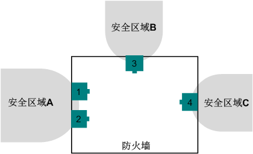

华为防火墙产品上默认已经为大家提供了三个安全区域，分别是Trust、DMZ和Untrust，光从名字看就知道这三个安全区域很有内涵，下面强叔就为大家逐一介绍：

- Trust区域，该区域内网络的受信任程度高，通常用来定义内部用户所在的网络。
- DMZ区域2，该区域内网络的受信任程度中等，通常用来定义内部服务器所在的网络。
- Untrust区域，该区域代表的是不受信任的网络，通常用来定义Internet等不安全的网络。

在网络数量较少、环境简单的场合中，使用默认提供的安全区域就可以满足划分网络的需求。当然，在网络数量较多的场合，您还可以根据需要创建新的安全区域。

如下图所示，假设接口1和接口2连接的是内部用户，那我们就把这两个接口划分到Trust区域中；接口3连接内部服务器，将它划分到DMZ区域；接口4连接Internet，将它划分到Untrust区域。

由此我们可以得知，不同网络间互访时报文在防火墙上所走的路线。例如，当内部网络中的用户访问Internet时，报文在防火墙上的路线是从Trust区域到Untrust区域；当Internet上的用户访问内部服务器时，报文在防火墙上的路线是从Untrust区域到DMZ区域。

除了在不同网络之间流动的报文之外，还存在从某个网络到达防火墙本身的报文（例如我们登录到防火墙上进行配置），以及从防火墙本身发出的报文，如何在防火墙上标识这类报文的路线呢？

如下图所示，防火墙上提供了Local区域，代表防火墙本身。凡是由防火墙主动发出的报文均可认为是从Local区域中发出，凡是需要防火墙响应并处理（而不是转发）的报文均可认为是由Local区域接收。

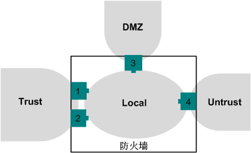

现在我们就可以把经过防火墙的流量和防火墙本身的流量都标识出来了，前面介绍过，不同的网络受信任的程度不同，在防火墙上用安全区域来表示网络后，怎么来判断一个安全区域的受信任程度呢？在华为防火墙上，每个安全区域都有一个唯一的安全级别，用1～100的数字表示，数字越大，则代表该区域内的网络越可信。对于默认的安全区域，它们的安全级别是固定的：Local区域的安全级别是100，Trust区域的安全级别是85，DMZ区域的安全级别是50，Untrust区域的安全级别是5。

级别确定之后，安全区域就被分成了三六九等，高低有别。报文在两个安全区域之间流动时，我们规定：**报文从低级别的安全区域向高级别的安全区域流动时为入方向（Inbound），报文从由高级别的安全区域向低级别的安全区域流动时为出方向（Outbound）。** 报文在两个方向上流动时，将会触发不同的安全检查。下图标明了Local区域、Trust区域、DMZ区域和Untrust区域间的方向。

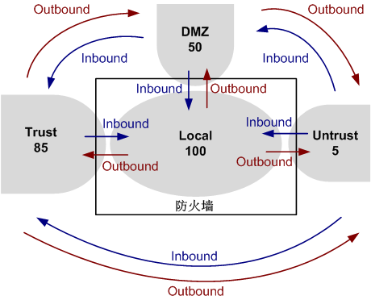

通过安全区域，防火墙上划分出了等级森严、关系明确的网络，防火墙成为连接各个网络的节点。以此为基础，防火墙就可以对各个网络之间流动的报文进行安全检查和实施管控策略。

下面给出了防火墙部署在企业内部的真实环境组网图。从图中我们可以看出，企业内部网络中的用户、服务器，以及位于外部的Internet，都被划分到不同的安全区域中了，防火墙对各个安全区域之间流动的报文进行安全检查。

1. 默认情况下，报文在不同的安全区域之间流动时，才会触发安全检查，在同一个安全区域中流动时，不会触发安全检查。同时，华为的防火墙也支持对同一个安全区域内经过防火墙的流量进行安全检查，更加灵活实用。
2. DMZ（Demilitarized Zone）起源于军方，是介于严格的军事管制区和松散的公共区域之间的一种部分管制的区域。防火墙引用了这一术语，指代一个与内部网络和外部网络分离的安全区域。

## 状态检测和会话机制

### 状态检测防火墙产生的背景
请大家先看一个简单的网络环境，如下图所示，PC和Web服务器位于不同的网络，分别与防火墙相连，PC与Web服务器之间的通信受到防火墙的控制。

当PC需要访问Web服务器浏览网页时，在防火墙上必须配置如下的一条规则，允许PC访问Web服务器的报文通过。

在这条规则中，源端口处的*表示任意的端口，这是因为PC在访问Web服务器时，它的操作系统决定了所使用的源端口，例如，对于WINDOWS操作系统来说，这个值可能是1024~65535范围内任意的一个端口。这个值是不确定的，所以这里设定为任意端口。

配置了这条规则后，PC发出的报文就可以顺利通过防火墙，到达Web服务器。然后Web服务器将会向PC发送回应报文，这个报文也要穿过防火墙才能到达PC。在状态检测防火墙出现之前，包过滤防火墙还必须配置如下所示的规则2，允许反方向的报文通过

在规则2中，目的端口也设定为任意端口，因为我们无法确定PC访问Web服务器时使用的源端口，要想使Web服务器回应的报文都能顺利穿过防火墙到达PC，只能将规则2中的目的端口设定为任意端口。

如果PC位于受保护的网络中，这样处理将会带来很大的安全问题。规则2将去往PC的目的端口全部开放，外部的恶意攻击者伪装成Web服务器，就可以畅通无阻地穿过防火墙，PC将会面临严重的安全风险。

接下来让我们看一下状态检测防火墙怎么解决这个问题。还是以上面的网络环境为例，首先我们还是需要在防火墙上设定规则1，允许PC访问Web服务器的报文通过。当报文到达防火墙后，防火墙允许报文通过，同时还会针对PC访问Web服务器的这个行为建立会话（Session），会话中包含了PC发出的报文信息，如地址和端口等。

当Web服务器回应给PC的报文到达防火墙后，防火墙会把报文中的信息与会话中的信息进行比对，发现报文中的信息与会话中的信息相匹配，并且符合协议规范对后续包的定义，则认为这个报文属于PC访问Web服务器行为的后续回应报文，直接允许这个报文通过，如下图所示。

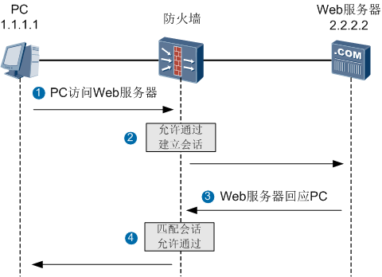

而恶意攻击者即使伪装成Web服务器向PC发起访问，由于这类报文不属于PC访问Web服务器行为的后续回应报文，防火墙就不会允许这些报文通过。这样就解决了包过滤防火墙大范围开放端口带来的安全风险，同时也保证了PC可以正常访问Web服务器。

总结一下，包过滤防火墙只根据设定好的静态规则来判断是否允许报文通过，它认为报文都是无状态的孤立个体，不关注报文产生的前因后果。而状态检测防火墙的出现正好弥补了包过滤防火墙的这个缺陷，状态检测防火墙使用基于连接状态的检测机制，将通信双方之间交互的属于同一连接的所有报文都作为整体的数据流来对待。在状态检测防火墙看来，同一个数据流内的报文不再是孤立的个体，而是存在联系的。为数据流的第一个报文建立会话，数据流内的后续报文直接根据会话进行转发，提高了转发效率。

接着我们就来进一步了解一下会话，会话是通信双方的连接在防火墙上的具体体现，代表两者的连接状态，一条会话就表示通信双方的一个连接。防火墙上多条会话的集合就叫做会话表（Session table），先看一个标准的会话表项：

http  VPN:public --> public 1.1.1.1:2049-->2.2.2.2:80

我们重点介绍这个表项中的关键字段：http表示协议，1.1.1.1表示源地址，2049表示源端口，2.2.2.2表示目的地址，80表示目的端口。我们是如何区分源和目的呢？其实通过“-->”符号就可以直观区分，符号前面的是源，符号后面的是目的。

源地址、源端口、目的地址、目的端口和协议这五个元素是会话的重要信息，我们将这五个元素称之为“五元组”。只要这五个元素相同的报文即可认为属于同一条流，在防火墙上通过这五个元素就可以唯一确定一条连接。

需要注意的是，会话是动态生成的，但不是永远存在的。如果长时间没有报文匹配，则说明通信双方已经断开了连接，不再需要该条会话了。此时，为了节约系统资源，防火墙会在一段时间后删除会话，该时间称为会话的老化时间。

光说不练假把式，下面强叔就使用eNSP模拟器来搭建一个简单的网络环境，验证防火墙上的状态检测机制。网络拓扑如下

防火墙上只配置了一条规则：允许PC访问Web服务器的报文通过。在PC上使用HttpClient程序访问Web服务器，发现可以成功访问：

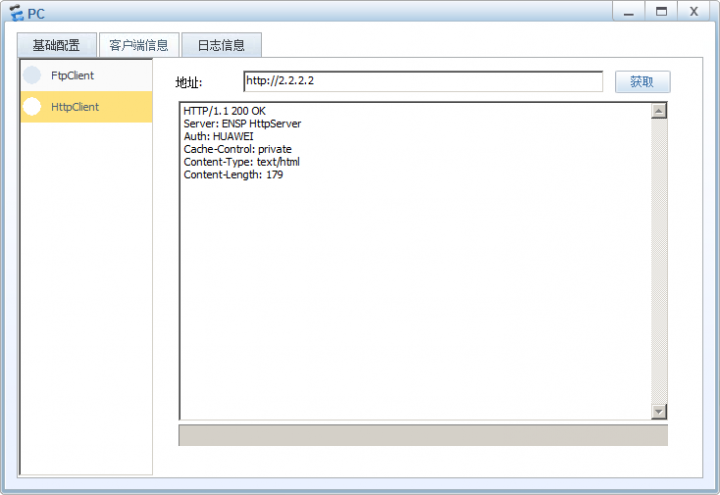

在防火墙上使用`display firewall session table`命令查看会话表的信息，发现已经建立一条会话：

说明状态检测机制工作正常，防火墙收到Web服务器返回给PC的报文后，发现该报文可以匹配到该条会话，即使没有配置允许反方向报文通过的规则，防火墙也允许其通过。

## 安全策略篇

防火墙的基本作用是保护特定网络免受“不信任”的网络的攻击，但是同时还必须允许两个网络之间可以进行合法的通信。安全策略的作用就是对通过防火墙的数据流进行检验，符合安全策略的合法数据流才能通过防火墙。

如上图所示，可以在不同的域间方向应用不同的安全策略进行不同的控制。

安全策略是由匹配条件和动作（允许/拒绝）组成的控制规则，可以基于IP、端口、协议等属性进行细化的控制。例如下边这条安全策略控制源IP是1.1.1.1的流量可以访问目的地址为2.2.2.2的Web服务器。

缺省情况下，所有域间的所有方向都禁止报文通过1，可以根据需求配置允许哪些数据流通过防火墙的安全策略。

1. 对于路由、ARP等底层协议一般是不受安全策略控制的，直接允许通过。当然这和具体产品实现有关，产品间可能有差异。

另外再说一下，除了经过防火墙转发的数据流，设备本身与外界互访的数据流也同样受安全策略的控制哦！例如当登录设备、网管与设备对接时，需要配置登录PC/网管所在安全区域与Local域之间的安全策略。

同时为了灵活应对各种组网情况，华为防火墙还支持配置域内策略，也就对同一个安全区域内经过防火墙的流量进行安全检查。当然缺省情况下是允许所有域内报文通过防火墙的。

有人可能要问了，缺省域间不允许数据流通过，我要逐条为允许通过的数据流配置安全策略也太繁琐了？比如我只想控制少数IP发起的流量不能经过防火墙，其他IP的流量都可以经过防火墙，有什么好办法吗？

当然有，防火墙出于安全考虑缺省情况拒绝所有流量经过，但是这个缺省情况是可以修改的，这就是 **“缺省包过滤”**。如果流量没有匹配到任何安全策略，将按缺省包过滤的动作进行处理。因此实现上述需求可只配置拒绝流量通过的安全策略，缺省包过滤改为permit。

### 安全策略的应用方向

既然一个域间有`Inbound`和`Outbound`两个方向，那是否需要为访问的双向流量同时配置安全策略呢？No，对于同一条数据流，在访问发起的方向上应用安全策略即可，反向报文不需要额外的策略。这点和路由器、交换机包过滤不一样，主要原因就是防火墙是状态检测设备，对于同一条数据流只有首包匹配安全策略并建立会话，后续包都匹配会话转发。

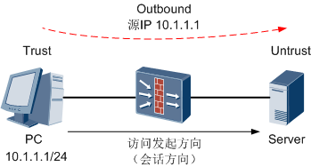

### 安全策略的匹配
防火墙将流量的属性与安全策略的条件进行匹配, 如果所有条件都匹配,则此流量成功匹配安全策略. 如果其中有一个条件不匹配, 则未匹配安全策略

同一域间或域内应用多条安全策略，策略的优先级按照配置顺序进行排列，越先配置的策略优先级越高，越先匹配报文。如果报文匹配到一条策略就不再继续匹配剩下的策略，如果没有匹配到任何策略就按缺省包过滤处理。所以配置策略还是有一定讲究的，要先细后粗。

举个具体的例子：企业FTP服务器地址为10.1.1.1，办公区IP段为`10.2.1.0/24`，要求禁止两台临时办公PC（10.2.1.1、10.2.1.2）访问FTP服务器。如下这样配置有什么问题？

这样配置将无法实现“禁止两台临时办公PC（10.2.1.1、10.2.1.2）访问FTP服务器”的需求，因为这两个IP已经命中了第一条宽泛的策略，无法再命中第二条策略。所以两条策略需要调换顺序。

#### 安全策略发展史
有同学可能要问了，啥安全策略，不就是包过滤吗？那你可out了，随着防火墙产品的推陈出新，包过滤也逐渐进化，已经发展成为可以做深度内容检查的“安全策略”。策略匹配条件也已经在“五元组”的基础上增加了用户、应用等匹配条件，还增加了内容安全检测处理。

下图展现了安全策略的发展历程，大家可以看到NGFW中已经实现了基于“七元组”的安全策略。细粒度的安全管控使藏匿于流量中的危险分子无所遁形。

### 基于ACL的包过滤
包过滤的处理过程是先获取需要转发数据包的报文头信息，然后和设定的ACL规则进行比较，根据比较的结果对数据包进行转发或者丢弃。实现包过滤的核心技术是访问控制列表ACL。

因此包过滤只能基于IP地址、端口号等控制流量是否可以通过防火墙，无法准确识别应用。

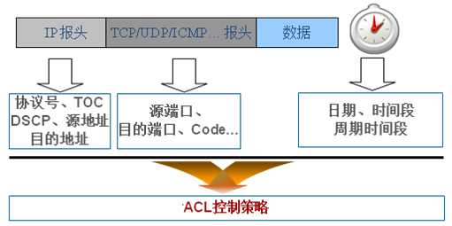

基于ACL的包过滤的配置方式是先配置好包含多条数据流规则（rule）的ACL，其中每条rule包含数据流的匹配条件和permit/deny动作，然后ACL再被域间包过滤引用。一个域间只能引用一个ACL。

### 发展中期的UTM设备安全策略
随着USG2000/5000系列UTM产品的推出，“安全策略”这个概念被提出。之所以不叫包过滤了，是因为策略中集成了UTM检测功能，配置方式也由ACL方式变为Policy方式。

通过下边这个界面可以直观的看到安全策略的组成：包过滤+UTM。不启用UTM功能时就是原始的包过滤；动作为permit的安全策略可以引用IPS、AV等UTM策略，对流量进一步进行UTM检测，通过检测的流量才能真正通过防火墙。

另外配置方式上也变为Policy方式，即在配置安全策略时直接指定匹配数据流的多种条件以及动作，配置更简单。

此时的安全策略已经有一体化安全处理的雏形了，将防火墙包过滤功能和内容安全功能进行了融合，但是还有一定局限性。

了解UTM的同学们应该知道，UTM更多的是体现功能集成，将传统防火墙、入侵防御设备、反病毒设备等集成到一个硬件。UTM设备的多个安全功能之间的紧密度不高，报文匹配安全策略的匹配条件后需要逐一进入各个UTM模块进行检测和处理，如果同时开启多个安全功能，设备性能往往大幅下降。

另外基于应用的管控需要配置额外的应用控制策略，不能直接将应用类型作为策略的匹配条件。例如需要禁止员工使用IM应用，此时要额外配置禁止IM应用的“应用控制策略”然后再在安全策略引用生效。也就是应用识别与管控需要进入另外一个模块处理。

### NGFW的一体化安全策略
到了NGFW阶段，对一体化、应用识别与管控、高性能等要求更高。安全策略充分体现了这些特质，通过应用、用户、内容、威胁等多个维度的识别将模糊的网络环境映射为实际的业务环境，从而实现精准的访问控制和安全检测。

## ASPF: 隐形通道

### FTP协议
FTP协议是一个典型的多通道协议, 在其工作工程中,FTP Client 和 FTP Server 之间建立两条链接; 控制连接和数据连接. 控制连接用来传输FTP指令和参数, 其中就包括建立数据连接所需要的信息; 数据连接用来获取目录及传输数据. 数据连接使用的端口号是在控制连接中临时协商的

根据数据连接的发起方式FTP协议分为两种工作模式: 主动模式(PORT模式)和被动模式(PASV模式). 主动模式中, FTP Server 主动向FTP CLient 发起数据连接; 被动模式中, FTP Server被动接受FTP Client发起的数据连接.

模式在一般的FTP客户端中都是可以设置的, 这里我们以主动模式为例进行讲解, 主动模式的协议交互流程如下:

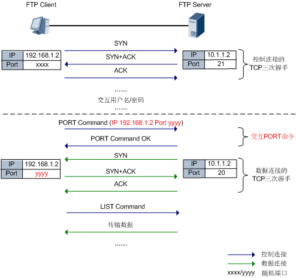

首先FTP客户端向FTP服务器的21端口发起连接建立控制通道, 然后通过PORT明林那个协商客户端使用的数据传输端口号. 协商成功后,服务器主动向客服端的这个端口号发起数据连接. 而且每次数据传输都会协商不同的端口号

而我们配置的安全策略仅开发了FTP协议, 也就是21端口. 当FTP客户端向服务器发起控制连接时建立了如下会话

而服务器向客户端发起数据连接的源/目的端口分别是 20 和 临时协商的端口号 yyyy, 显示不是这条连接的后续报文, 无法命中此会话转发. 因此会出现可以验证用户密码, 但是无法获取目录列表的现象

有同学可能想到了，在服务器到客户端的方向也配置安全策略就行了吧？对，这是一种方法，但是这样必须开放客户端的所有端口有安全隐患。要是有一种方法可以自动记录数据连接就好了！

别急，万能的防火墙都能实现。这就是本期要出场的神秘人物ASPF（Application Specific Packet Filter）。**ASPF是针对应用层的包过滤，其原理是检测通过设备的报文的应用层协议信息，记录临时协商的数据连接，使得某些在安全策略中没有明确定义要放行的报文也能够得到正常转发**。

记录临时协商的数据连接的表项称为Server-map表1，这相当于在防火墙上开通了“隐形通道”，使得像FTP这样的特殊应用的报文可以正常转发。当然这个通道不是随意开的，是防火墙分析了报文的应用层信息之后，提前预测到后面报文的行为方式，所以才打开了这样的一个通道。

1. Server-map表在防火墙转发中非常重要，不只是ASPF会生成，NAT Server、SLB等特性也会生成Server-map表，后续在其他帖子中强叔还会提及。

说了这么多ASPF怎么配置呢，很简单，在域间配置一条命令即可`detect protocol`。

FTP访问成功：

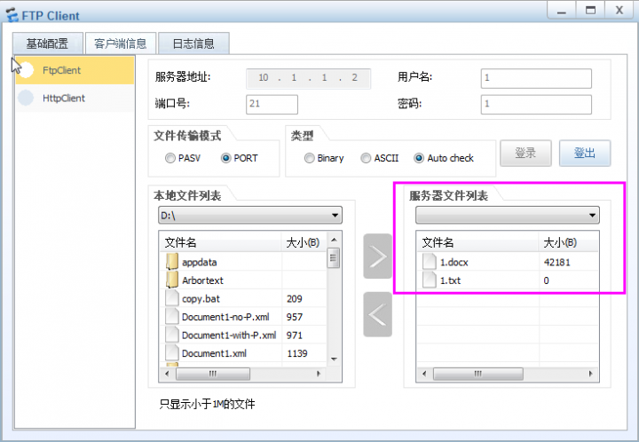

此时查看Server-map，可以看到已经自动生成了维护FTP数据连接的表项：

Server-map表中记录了FTP服务器向FTP客户端的2071端口号发起的数据连接，服务器向客户端发起数据连接时将匹配这个Server-map表转发，而无需再配置反向安全策略。

数据连接的第一个报文匹配Server-map表转发后，防火墙将生成这条数据连接的会话，该数据连接的后续报文匹配会话表转发，不再需要重新匹配Server-map表项

Server-map表项由于一直没有报文匹配，经过一定老化时间后就会被删除。这种机制保证了Server-map表项这种较为宽松的通道能够及时被删除，保证了网络的安全性。当后续发起新的数据连接时会重新触发建立Server-map表项。

本期以FTP协议的主动模式为例做了讲解，FTP的被动模式、其他多通道协议类似，不再一一讲解。总之就是配置了ASPF可以生成动态维护临时协商的数据连接的表项，既简化了安全策略的配置又确保了安全性。最后以一张图作为结束。

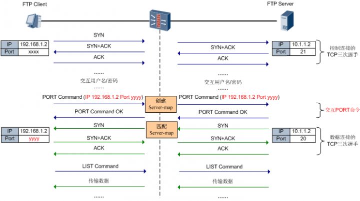

## 单包攻击及防御
### 什么是DoS攻击?
Dos是Denial Of Service的简称, 即拒绝服务,造成DoS攻击, 其目的是使计算机或网络无法提供正常的服务.

那么， “拒绝服务”是什么意思呢？下面我们就打个形象的比喻。

街边有一个小餐馆为大家提供餐饮服务，但是这条街上有一群地痞总是对餐馆搞破坏，比如：霸占着餐桌不让其他客人吃饭也不结账、或者堵住餐馆的大门不让客人进门，甚至骚扰餐馆的服务员或者厨师不让他们正常干活，这样餐馆就没有办法正常营业了，这就是“拒绝服务”。Internet中的计算机或者服务器就像是这个餐馆一样，为Internet用户提供互联网资源，如果黑客想要对这些计算机或者服务器进行DoS攻击的话，也使用消耗计算机或服务器性能、抢占链路带宽等手段！

最常见的DoS攻击就是我们常常提到的单包攻击。这类攻击一般都是以个人为单位的黑客发动的，攻击报文也比较单一，虽然破坏力强大，但是只要掌握了攻击的特征，防御起来还是比较容易的。

防火墙支持的单包攻击包括以下三大类

- 畸形报文攻击：通常指攻击者发送大量有缺陷的报文，从而造成主机或服务器在处理这类报文时系统崩溃。
- 扫描类攻击：是一种潜在的攻击行为，并不具备直接的破坏行为，通常是攻击者发动真正攻击前的网络探测行为。   
- 特殊控制报文攻击：也是一种潜在的攻击行为，不具备直接的破坏行为，攻击者通过发送特殊控制报文探测网络结构，为后续发动真正的攻击做准备。

单包攻击防御是防火墙具备的最基本的防范功能，华为全系列防火墙都支持对单包攻击的防御。下面强叔就带大家认识几种典型的单包攻击，一起了解下华为防火墙是如何防范这些攻击的。

### Ping of Death 攻击及防御
操作系统处理数据包的大小是有限制的, IP报文的长度字段为16位, 即IP报文的最大长度位65535, 如果遇到大小超过65535的报文, 会出现内存分配错误, 从而使接收方的计算机系统崩溃. Ping of Death 攻击就是攻击者不断的通过ping命令向攻击目标发送超过65535的报文. 就可以使目标计算机的TCP/IP堆栈崩溃, 致使接收方系统崩溃.

防火墙在处理Ping of Death攻击报文时，是通过判定数据包的大小是否大于65535字节，如果数据包大于65535字节，则判定为攻击报文，直接丢弃。

### Land 攻击及防御
Land攻击是指攻击者向受害者发送伪造的TCP报文，此TCP报文的源地址和目的地址同为受害者的IP地址。这将导致受害者向它自己的地址发送回应报文，从而造成资源的消耗。

防火墙在处理Land攻击报文时，通过检查TCP报文的源地址和目的地址是否相同，或者TCP报文的源地址是否为环回地址，如果是则丢弃。

### IP地址扫描攻击
IP地址扫描攻击是攻击者运用ICMP报文(如ping和Tracert命令)探测目标地址, 或者使用TCP/UDP报文对一定地址发起连接, 通过判断是否有应答报文,以确定哪些目标系统确实存活着并且连接在目标网络上.

防火墙对收到的TCP, UDP,ICMP报文进行检测, 当某源IP地址连续发送报文的目的IP地址与前一个报文的目的IP地址不同时,则记为一次异常, 当异常次数超过预定义的阈值时, 则认为该源ip的行为为ip地址扫扫描行为,防火墙会将该源IP地址加入黑名单。

可以看出，IP地址扫描攻击并没有直接造成什么恶劣后果，它只是一种探测行为，通常是为了后续发动破坏性攻击做准备，尽管如此，这种行为我们防火墙也不会放过的。

从以上几种攻击及防御手段，我们可以发现，单包攻击一般都具有明显的特征，所以防火墙在防御单包攻击时，只要匹配了攻击特征，就可以很容易防御。

#### 配置建议

防火墙支持的单包攻击防御种类繁多，在现网使用过程中，哪些需要配置，或者哪些不建议配置一直困扰着大家。下面强叔就为大家列举一下，哪几种攻击建议开启，哪几种攻击的防御不建议开启？ 

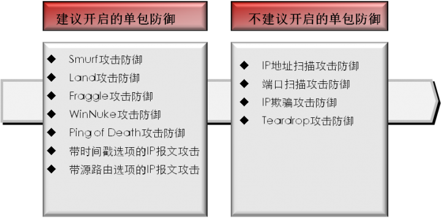

建议开启的单包攻击防御一般是现网比较常见的攻击，这种攻击开启以后，防火墙可以很好的进行防御，对性能等方面没有影响。而扫描类攻击在防御过程中比较消耗防火墙的性能，所以不建议开启。

其实，单包攻击在现网中所占的比例并不高，现网中最主流，也让人们最头疼的攻击其实是DDoS攻击。DDoS攻击种类比较多，华为防火墙支持的DDoS攻击包括SYN Flood、UDP Flood、ICMP Flood等流量型攻击，以及HTTP Flood、HTTPS Flood、DNS Flood等应用层攻击

## 流量型攻击之 SYN Flood及防御

在现网中单包攻击只占了很小一部分比例，更多的攻击还是集中在流量型攻击和应用层攻击。本期强叔将继续为大家讲解一下现网上常见的流量型攻击

过去，攻击者所面临的主要问题是网络带宽，由于较小的网络规模和较慢的网络速度的限制，攻击者无法发出过多的请求。虽然类似“Ping of Death”的攻击类型只需要较少量的包就可以摧毁一个没有打过补丁的操作系统，但大多数的DoS攻击还是需要相当大的带宽，而以个人为单位的黑客们很难消耗高带宽的资源。为了克服这个缺点，DoS攻击者开发了分布式的攻击。
木马成为黑客控制傀儡的工具，越来越多的计算机变成了肉鸡，被黑客所利用，并变成了他们的攻击工具。黑客们利用简单的工具集合许多的肉鸡来同时对同一个目标发动大量的攻击请求，这就是DDoS(Distributed Denial of Service)攻击。

### SYN Flood的攻击和防御

最初的SYN Flood攻击类似于协议栈攻击，在当年的攻击类型中属于技术含量很高的“高大上”。当年由于系统的限制以及硬件资源性能的低下，称霸DDoS攻击领域很久。它与别人的不同在于，你很难通过单个报文的特征或者简单的统计限流防御住它，因为它“太真实”、“太常用”。
SYN Flood具有强大的变异能力，在攻击发展潮流中一直没有被湮没，这完全是他自身的优秀基因所决定的：

1. 单个报文看起来很“真实”，没有畸形。
2. 攻击成本低，很小的开销就可以发动庞大的攻击。

#### TCP三次握手
SYN flood是基于TCP协议栈发起的攻击, 在了解SYN flood攻击和防御原理之前, 还是要从TCP连接建立的过程开始说起. 在TCP/IP协议中，TCP协议提供可靠的连接服务，无论是哪一个方向另一方发送数据前，都必须先在双方之间建立一条连接通道，这就是传说中的TCP三次握手。

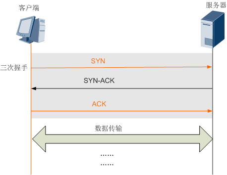

1. 第一次握手：客户端向服务器端发送一个SYN（Synchronize）报文，指明想要建立连接的服务器端口，以及序列号ISN
2. 第二次握手：服务器在收到客户端的SYN报文后，将返回一个SYN+ACK的报文，表示客户端的请求被接受，同时在SYN+ACK报文中将确认号设置为客户端的ISN号加1。 ACK即表示确认（Acknowledgment）
3. 第三次握手：客户端收到服务器的SYN-ACK包，向服务器发送ACK报文进行确认，ACK报文发送完毕，三次握手建立成功

如果客服端在发送了SYN报文后出现了故障, 那么服务器在发出SYN + ACK应答报文后是无法收到客户端的ACK报文的, 即第三次握手无法完成. 这种情况下服务器端一般会重试，向客户端再次发送SYN+ACK，并等待一段时间。如果一定时间内，还是得不到客户端的回应，则放弃这个未完成的连接。这也是TCP的重传机制。

SYN Flood攻击正是利用了TCP三次握手的这种机制。攻击者向服务器发送大量的SYN报文请求，当服务器回应SYN+ACK报文时，不再继续回应ACK报文，导致服务器上建立大量的半连接，直至老化。这样，服务器的资源会被这些半连接耗尽，导致正常的请求无法回应

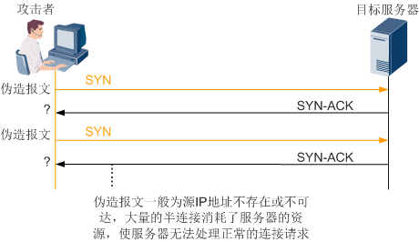

防火墙对SYN Flood攻击, 一般会采用TCP代理和探测两种方式进行防御

### TCP代理
TCP代理是指我们的防火墙部署在客户端和服务器中间，当客户端向服务器发送的SYN报文经过防火墙时，防火墙代替服务器与客户端建立三次握手。一般用于报文来回路径一致的场景

1. 防火墙收到SYN报文，对SYN报文进行拦截，代替服务器回应SYN+ACK报文。
2. 如果客户端不能正常回应ACK报文，则判定此SYN报文为非正常报文，防火墙代替服务器保持半连接一定时间后，放弃此连接。
3. 如果客户端正常回应ACK报文，防火墙与客户端建立正常的三次握手，则判定此SYN报文为正常业务报文，非攻击报文。防火墙立即与服务器再建立三次握手，此连接的后续报文直接送到服务器。

整个TCP代理的过程对于客户端和服务器都是透明的。

TCP代理过程中，防火墙会对收到的每一个SYN报文进行代理和回应，并保持半连接，所以当SYN报文流量很大时，对防火墙的性能要求非常的高。

了解了攻击原理，再学习防御原理，是不是觉得很容易理解。讲了这么多，大家对SYN Flood的攻击以及TCP代理防御是不是有了一定的认识。其实，TCP代理的本质就是利用防火墙的高性能，代替服务器承受半连接带来的资源消耗，由于防火墙的性能一般比服务器高很多，所以可以有效防御这种消耗资源的攻击。

但是TCP代理只能应用在报文来回路径一致的场景中，如果来回路径不一致，代理就会失败。可是在现网中，报文来回路径不一致的场景也是很常见的，那这种情况下如果发生了SYN Flood攻击，防火墙要怎么防呢？
不用担心，我们还有第二个杀手锏：TCP源探测！

#### TCP源探测
TCP源探测是防火墙防御SYN Flood攻击的另一种方式，没有报文来回路径必须一致的限制，所以应用普遍。

1. 当防火墙收到客户端发送的SYN报文时，对SYN报文进行拦截，并伪造一个带有错误序列号的的SYN+ACK报文回应给客户端。
2. 如果客户端是虚假源，则不会对错误的SYN+ACK报文进行回应。
3. 如果客户端是真实源发送的正常请求SYN报文，当收到错误的SYN+ACK报文时，会再发出一个RST报文，让防火墙重新发一个正确的SYN+ACK报文；防火墙收到这个RST报文后，判定客户端为真实源，则将这个源加入白名单，在白名单老化前，这个源发出的报文都认为是合法的报文，防火墙直接放行，不在做验证。

这里，我们再回头对比一下TCP源探测和TCP代理两种方式，会发现TCP源探测对客户端的源只做一次验证通过后，就加入白名单，后续就不会每次都对这个源的SYN报文进行验证，这样大大提高了TCP源探测的防御效率和防御性能，可以有效缓解防火墙性能压力。

讲了这么多，大家是不是就会觉得TCP源探测对于SYN Flood已经是一个完美的防御方案了呢？它会不会也有什么弱点呢？

很长一段时间里，SYN Flood在防火墙TCP代理和TCP源探测双重防御的压制下，得到了遏制。但是随着木马被广泛植入到更多的肉鸡，一个初级黑客简单操作就可以操纵动则上G流量的时候， SYN Flood变得更加嗜血。TCP代理和TCP源探测方式说到底都是使用防火墙牺牲自身的CPU不断的来解决问题。但是一旦海量低开销的SYN Flood攻击报文同时蜂拥而至时，这种伤敌一千自损八百的方式将走向另外一个极端，防火墙很有可能成为瓶颈。华为防火墙在不断提升自身性能的同时，还是可以承担一定的开销。但是传统的防御手段都是反弹，也就是说如果攻击流量是1G的话，防火墙的反弹流量也有1G，这样就相当于有2G的“攻击”流量在互联网上占据着带宽，我们在防御的过程中不自觉的放大了垃圾流量，拥塞了链路。

TCP提供可靠的传输层，其中可靠性的保障之一就是确认从另一端收到的数据。但是数据和确认在传输过程中都有丢弃的可能，所以TCP通过在发送时设置一个定时器来解决这个问题。如果定时器到达设置的时间了，还是没有收到某个数据的确认报文，则TCP就会重传这个数据。华为专业AntiDDoS设备正是利用了TCP这种重传的机制，推出“首包丢弃”功能与“TCP源探测”结合的防御方式，以应对超大流量的SYN Flood攻击。当SYN报文蜂拥而至时，专业AntiDDoS设备会将收到的第一个报文记录并直接丢弃，然后等待第二个重传报文。收到重传报文后，再对重传报文进行源探测。

## 流量型攻击之UDP Flood及防御
讲UDP Flood之前，强叔还是先从UDP协议讲起。在讲SYN Flood的时候，我们知道了TCP协议是一种面向连接的传输协议。但是UDP协议与TCP协议不同， UDP是一个无连接协议。使用UDP协议传输数据之前，客户端和服务器之间不建立连接，如果在从客户端到服务器端的传递过程中出现数据的丢失，协议本身并不能做出任何检测或提示。因此，通常人们把UDP协议称为不可靠的传输协议。

既然UDP是一种不可靠的网络协议，那么还有什么使用价值或必要呢？

其实不然，在有些情况下UDP协议可能会变得非常有用。因为UDP具有TCP所望尘莫及的速度优势。虽然TCP协议中植入了各种安全保障功能，但是在实际执行的过程中会占用大量的系统开销，无疑使传输速度受到严重的影响。反观UDP，由于排除了信息可靠传递机制，将安全和排序等功能移交给上层应用来完成，极大降低了执行时间，使传输速度得到了保证

正是UDP协议的广泛应用，为黑客们发动UDP Flood攻击提供了平台。UDP Flood属于带宽类攻击，黑客们通过僵尸网络向目标服务器发起大量的UDP报文，这种UDP报文通常为大包，且速率非常快，通常会造成以下危害：

- 消耗网络带宽资源，严重时造成链路拥塞。
- 大量变源变端口的UDP Flood会导致依靠会话转发的网络设备，性能降低甚至会话耗尽，从而导致网络瘫痪。

防火墙对UDP Flood的防御并不能像SYN Flood一样，进行源探测，因为它不建立连接。那应该怎么防御呢？

最初防火墙对UDP Flood的防御方式就是限流，通过限流将链路中的UDP报文控制在合理的带宽范围之内。

防火墙上针对UDP Flood的限流有三种：
- 基于目的IP地址的限流：即以某个IP地址作为统计对象，对到达这个IP地址的UDP流量进行统计并限流，超过部分丢弃。
- 基于目的安全区域的限流：即以某个安全区域作为统计对象，对到达这个安全区域的UDP流量进行统计并限流，超过部分丢弃。
- 基于会话的限流：即对每条UDP会话上的报文速率进行统计，如果会话上的UDP报文速率达到了告警阈值，这条会话就会被锁定，后续命中这条会话的UDP报文都被丢弃。当这条会话连续3秒或者3秒以上没有流量时，防火墙会解锁此会话，后续命中此会话的报文可以继续通过。

限流虽然可以有效缓解链路带宽的压力，但是这种方式简单粗暴，容易对正常业务造成误判。为了解决这个问题，防火墙又进一步推出了针对UDP Flood的指纹学习功能。

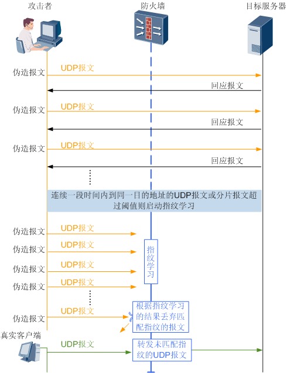

仔细分析，不难发现，UDP Flood攻击报文具有一定的特点，这些攻击报文通常都拥有相同的特征字段，比如都包含某一个字符串，或整个报文内容一致。这些字段来自于DDoS工具自带的默认字符串，所以防火墙是通过收集这些字符串来检测UDP Flood。这种防御算法在现网使用很多，主要因为黑客为了加大攻击频率，快速、长时间挤占攻击目标所在网络带宽，在使用攻击工具实现时直接在内存存放一段内容，然后高频发送到攻击目标，所以攻击报文具有很高的相似性。而正常业务的UDP报文一般每个报文负载内容都是不一样的，这样可以减少误判。

从下面的抓包中可以看出，到达相同目的IP地址的两个UDP报文的载荷是完全一样的，如果防火墙收到大量的类似这样的UDP报文，那么就有可能是发生了UDP Flood攻击。

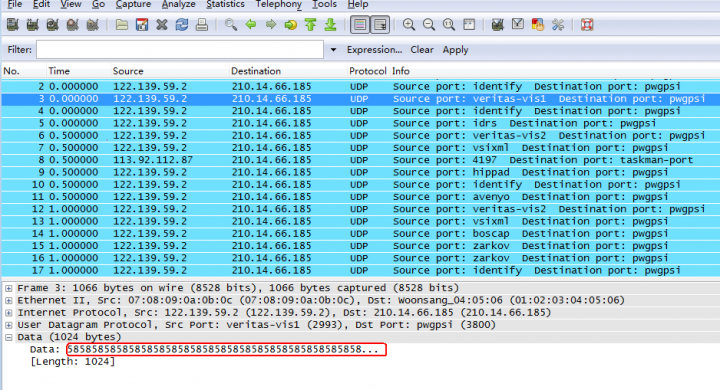

指纹学习是通过分析客户端向服务器发送的UDP报文载荷是否有大量的一致内容，来判定这个UDP报文是否异常。防火墙对到达指定目的地的UDP报文进行统计，当UDP报文达到告警阈值时，开始对UDP报文的指纹进行学习。如果相同的特征频繁出现，就会被学习成指纹，后续命中指纹的报文判定这是攻击报文，作为攻击特征进行过滤。

## 应用层攻击及防御
### DNS Flood
通常情况下，我们在上网访问网页的时候，输入的网址都是域名，比如 www.huawei.com，这个请求的域名会发送到DNS缓存服务器，以请求其对应的IP地址。如果DNS缓存服务器上有此域名和IP地址的映射关系，DNS缓存服务器就会将查询到得IP地址返回给客户端。

当DNS缓存服务器查找不到该域名与IP地址对应关系时，它会向授权DNS服务器发出域名查询请求。为了减少Internet上DNS的通信量，DNS缓存服务器会将查询到的域名和IP地址对应关系存储在自己的本地缓存中。后续再有主机请求该域名时，DNS缓存服务器会直接用缓存区中的记录信息回应，直到该记录老化，被删除

常见的DNS Flood攻击一般都是攻击者向DNS服务器发送大量的不存在的域名解析请求，导致DNS缓存服务器不停向授权服务器发送解析请求，最终导致DNS缓存服务器或者DNS授权服务器瘫痪，影响对正常请求的回应。

我们先从DNS协议本身讲起。DNS服务器支持TCP和UDP两种协议的查询方式，但是大多数的查询都是使用UDP查询的，我们都知道，UDP提供无连接服务，传输速度快，可以降低服务器的负载。

也有特殊情况需要通过TCP方式查询，其中之一，就是DNS服务器可以设定使用TCP连接。当客户端向DNS服务器发起查询请求时，DNS回应报文里有一个TC标志位，如果TC标志位置1，就表示需要通过TCP方式查询。我们的防火墙就是利用这一机制对DNS Flood攻击进行防御。

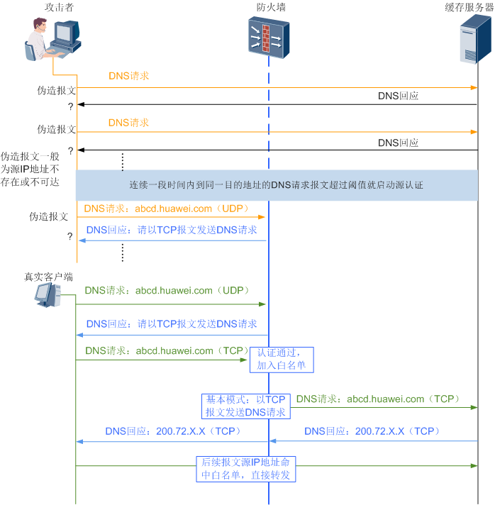

上图中，当发生DNS Flood攻击时，防火墙收到DNS请求，会代替DNS服务器响应DNS请求，并将TC标志位置1，要求DNS客户端以TCP方式发送DNS请求。

- 如果客户端是真实源，会继续以TCP方式发送DNS请求。

- 如果客户端是虚假源，则不会再以TCP方式发送DNS请求。

我们再来看一组真实客户端正常响应防火墙源探测的抓包信息：

1. 客户端向DNS服务器以UDP方式发送查询请求。
    
    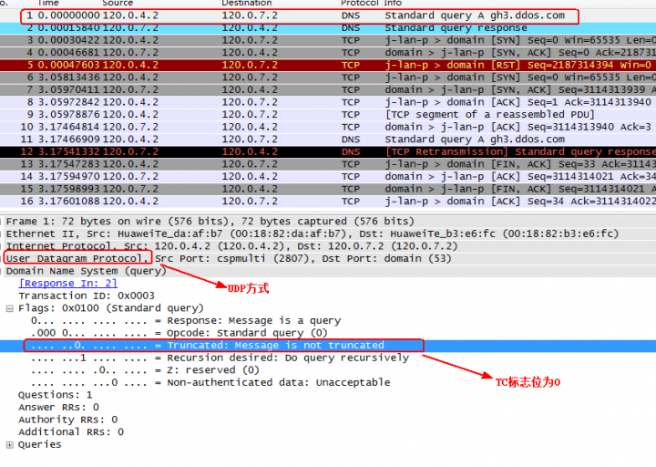

2. 防火墙将TC标志位置1，让客户端以TCP方式发送请求。

    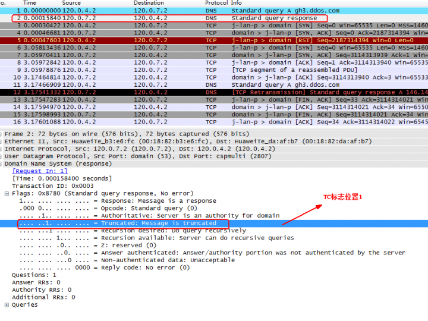

3. 客户端以TCP方式发送DNS请求。

    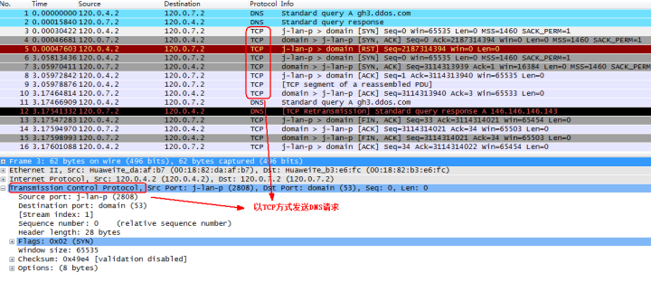

这种方式可以很好的防御针对缓存服务器的DNS请求攻击，但是在现网使用过程中，并不是所有场景都适用。因为在源探测过程中，防火墙会要求客户端通过TCP方式发送DNS请求，但是并不是所有的客户端都支持以TCP方式发送DNS请求，所以这种方式在使用过程中也有限制。如果有正常客户端不支持以TCP方式发送DNS请求，使用此功能时，就会影响正常业务。

### HTTP Flood
说完了DNS Flood攻击，强叔再给大家讲讲另一种常见的应用层攻击：HTTP Flood。近几年，HTTP Flood攻击所占比例呈逐年上升趋势，不可小觑。

常见的HTTP Flood攻击，一般指黑客通过代理或僵尸主机向目标服务器发起大量的HTTP报文，这些请求涉及数据库操作的URI或其它消耗系统资源的URI，目的是为了造成服务器资源耗尽，无法响应正常请求。

防火墙对于HTTP Flood的防御，主要依靠HTTP协议所支持的重定向方式，譬如说客户端向服务器请求www.sina.com，服务器可以返回一个命令，让客户端改为访问www.sohu.com。这种重定向的命令在HTTP协议栈中是合法的。我们防火墙的防御机制就是利用这个技术点，来探测HTTP客户端是否为真实存在的主机。

HTTP报文的正常重定向过程是这样的

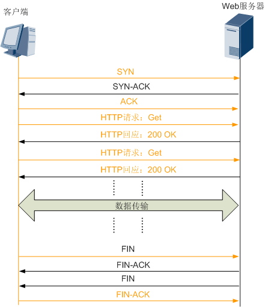

防火墙正是利用了HTTP报文的这种重定向机制，在防御HTTP Flood攻击过程中，向客户端重定向一个其他的URI

上图可以看出，当客户端访问search1.huawei.com的时候，防火墙重定向了一个search2.huawei.com地址给客户端让它访问：

- 如果客户端是虚假源，在收到防火墙发送的重定向地址后，不会重新发送HTTP请求。
- 如果客户端是真实源，则会对防火墙的重定向报文进行响应，并重新向search2.huawei.com地址发送请求。这样，防火墙收到search2.huawei.com请求后，即可判定这个客户端是真实源，并将这个客户端加入白名单。
 
虽然在整个过程中，客户端需要自动重定向两次，但是时间是很短的，不会影响客户体验。

我们再看一组真实客户端正常响应防火墙重定向请求的抓包信息：
1. 客户端请求包含URI为“/index.html”的页面。

    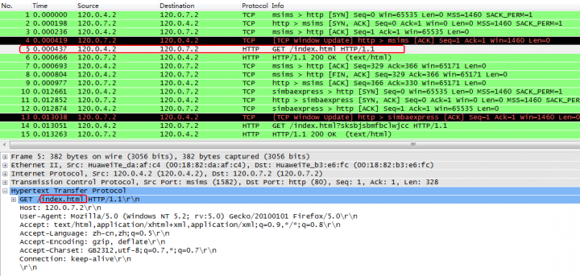

2. 防火墙对请求报文进行确认，并重定向一个新的URI“/index.html?sksbjsbmfbclwjcc”给客户端

    

3. 客户端重新请求包含URI为“/index.html?sksbjsbmfbclwjcc”的页面。

    

4. 防火墙对包含新URI的请求进行确认，并将地址重新定向成包含URI为“/index.html”的页面。认证通过，后续客户端可以直接和服务器进行通信。整个过程对于用户来说是透明的，重定向操作由客户端浏览器自动完成。

    

该模式可有效阻止来自非浏览器客户端的访问，如果僵尸工具没有实现完整的HTTP协议栈，不支持自动重定向，无法通过认证。而浏览器支持自动重定向，可以通过认证。这种防御方式在使用过程中，要确认客户端是否支持重定向。比如，常见的机顶盒就不支持自动重定向。所以在使用这种防御方式时，一定要确认所在的网络是否有机顶盒等客户端的正常业务，如果有，就不能使用此功能，否则会影响正常业务。

### 关于阈值怎么配置？
在这几期介绍的攻击防范中，大家对于Flood类攻击的阈值配置一直存在着疑惑，这里强叔给大家统一说明一下配置原则。

告警阈值配置要合理，如果配置过大，来攻击的时候就会防不住；如果配置过小，可能会把正常业务误判为攻击报文进行处理。

但是每个网络的流量模型都不同，所以配置阈值之前，需要有个前提准备，就是要大概了解这个网络正常情况下的每种类型报文的基本流量模型。这个值可能是管理员的一个经验值，也可以通过监测一段时间后通过工具学习得知。比如，我们想配置SYN Flood防御功能，配置告警阈值前，要先了解没有发生攻击的情况下网络中SYN报文的最大速率是多少，然后再配置SYN Flood防御的告警阈值，一般可以配置为正常流量时的1.2 ~2倍。配置完告警阈值后，还要连续多观察几天，看这个阈值对正常业务是否有影响，如果有影响，要及时调整成更大的值。

